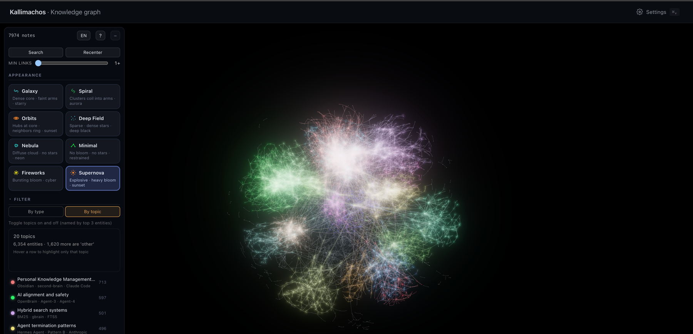
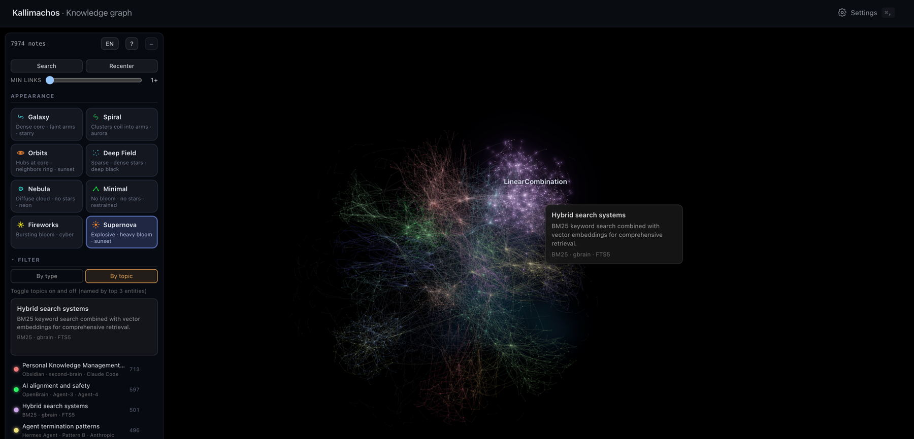

<h1 align="center">Kallimachos</h1>

<p align="center">
  <strong>Give Claude a memory of everything you wrote.</strong><br/>
  Your Obsidian vault and Claude Code sessions become one knowledge graph, served over MCP with a source behind every answer.
</p>

<p align="center">
  <a href="#quick-start">Quick start</a> ·
  <a href="#the-mcp-tools">MCP tools</a> ·
  <a href="#the-galaxy-view">Galaxy view</a> ·
  <a href="#how-it-works">How it works</a> ·
  <a href="#what-stays-on-your-machine">Privacy</a> ·
  <a href="docs/">Docs</a> ·
  <a href="LICENSE">AGPL-3.0</a>
</p>

<p align="center">
  <a href="https://github.com/HwangTaehyun/kallimachos/blob/main/LICENSE"></a>
  <a href="https://github.com/HwangTaehyun/kallimachos/releases"></a>
  <a href="https://kallimachos.dev"></a>
</p>



<p align="center"><em>The author's actual vault, rendered by the viewer: 7,974 entities in 20 topics, one colour per topic. Topics are found by community detection and named from their top entities. The <a href="#try-it-on-the-demo-vault">demo vault</a> in this repo reproduces a smaller graph end-to-end.</em></p>

## What is this, really?

Kallimachos is a **local pipeline plus an MCP server** for your own writing. It scans a folder of Markdown — an Obsidian vault, plus your distilled Claude Code session logs — and extracts **entities and relations** into a searchable graph (LanceDB: BM25 + multilingual embeddings + entity/relation vectors, fused with measured weights).

Then it hands that graph to Claude over MCP. When you ask *"what did we decide on auth in that March review?"*, the answer comes back **with the documents it came from**. Every entity and relation response carries `docs` and `refs`, so you never have to trust it blindly.

Extraction runs **on your machine, on your own Claude subscription** (`claude -p`). Indexing, embeddings and search are fully local. Nothing requires a server.

## Stuff you can do

- **Ask questions, not keywords** — "why did we reject JWT" finds the decision *and* the session where it happened, ranked by graph relations, not just string matches.
- **Make Claude Code remember** — session logs are distilled into the same graph as your notes. Yesterday's architecture debate becomes tomorrow's context.
- **See your vault as a galaxy** — an Obsidian plugin (and a standalone web build) renders entities as stars and relations as edges, grouped and coloured by topic.
- **Search Korean that actually works** — multilingual-e5-small embeddings layered with a 2·3-gram full-text index. Embedding-only setups quietly collapse on Korean; this hybrid doesn't.
- **Track how a decision changed** — `kal_timeline` shows what was written about an entity, when, and what superseded what.

## A look inside

Real output, from the demo vault in this repo (`docs/demo-vault/`), on a cold database:

```
$ python src/kal_search.py "why did we choose session cookies over JWT" --snippets

   1. [0.936] 📓 wiki/auth-decision.md
   2. [0.935] 💬 raw/conversations/sessions/2026-03-14-auth-review.md
   3. [0.599] 📓 wiki/redis-sessions.md
   4. [0.524] 📓 wiki/redis-eviction.md
   ...

  › wiki/auth-decision.md
    Auth decision — signed session cookies … JWTs cannot be revoked after issue
    without a denylist, which reintroduces server state …
  › raw/conversations/sessions/2026-03-14-auth-review.md
    Session — auth design review … JWT denylist adds a Redis lookup per request
    anyway, erasing the stateless benefit. Signed HttpOnly cookies with
    SameSite=Lax chosen …
```

The decision note and the **conversation where the decision actually happened** arrive one point apart at the top: relation vectors (weight 0.59 in the default profile) pull both up. See [`docs/HYBRID_METHODOLOGY.md`](docs/HYBRID_METHODOLOGY.md) for how the weights were measured.

## Status

| ✅ Works today | 🚧 Being wired up | 💭 Strong opinions, pending code |
|---|---|---|
| Index · hybrid search · CLI | Prebuilt image on GHCR (`docker pull`) | Multi-vault comparison |
| Entity/relation extraction via your `claude` CLI | Hosted remote MCP at [kallimachos.dev](https://kallimachos.dev) | Graph-aware note suggestions |
| Claude Code **MCP plugin** (5 tools, containerised) | | |
| Obsidian **galaxy view** plugin + web build | | |
| Local web UI (Docker) | | |
| Codex / other MCP clients | | |

## Quick start

**Requirements:** Python 3.11+ and [`uv`](https://docs.astral.sh/uv/). Docker for the web UI and the MCP plugin. The `claude` CLI only for the extraction step.

### Path A — Claude Code plugin (recommended)

The repository is itself a Claude Code plugin. The MCP server runs in a container — nobody has to install Python or a 1.1 GB venv.

```bash
git clone https://github.com/HwangTaehyun/kallimachos.git kal && cd kal

# 1. Build the image (until it is published on GHCR, build locally — same tag the manifest expects)
just build-kal && docker tag kal:local ghcr.io/hwangtaehyun/kal:0.1.2

# 2. Index your vault once (the tools answer "no index yet" until you do)
docker run --rm -v ~/.kal:/data -v /path/to/vault:/vault:ro \
  ghcr.io/hwangtaehyun/kal:0.1.2 src/schema_v3.py

# 3. Register and install the plugin — paths are yours, so they are asked for
claude plugin marketplace add /path/to/kal
claude plugin install kal@kallimachos \
  --config vault_dir=/path/to/vault \
  --config kal_dir=$HOME/.kal \
  --config run_as=$(id -u):$(id -g)

# 4. Verify
claude mcp list | grep kal        # → ✔ Connected
```

> ⚠️ `run_as` defaults to `1000:1000`; macOS is usually `501:20`. If it doesn't match, mounted folders are unreadable and you get **empty results, no error**.

### Path B — CLI pipeline on the host

```bash
git clone https://github.com/HwangTaehyun/kallimachos.git kal && cd kal
just init                    # TUI: pick your notes folder, see the cost, index to searchable
```

Or by hand:

```bash
just setup                   # uv sync + .env (~64s cold, idempotent)
just vault ~/my-notes        # tell CLI *and* containers where the notes live
just run index               # docs → chunks → vectors → inverted index  (~seconds)
just search "that auth decision"
```

`just run extract` then enriches the graph with entities and relations — it calls your local `claude` CLI, shows the estimated cost first, and asks before running. `just status` always tells you what is stale and what to run next.

### Path C — Docker only

```bash
docker compose -f docker-compose.kal.yml build
docker compose -f docker-compose.kal.yml run --rm kal src/schema_v3.py     # index
docker compose -f docker-compose.kal.yml run --rm kal src/kal_mcp.py --selftest
just up                      # local web UI → http://localhost:5173
```

The embedding model is baked into the image — no network needed at runtime.

### Try it on the demo vault

Everything above works on the synthetic demo vault in [`docs/demo-vault/`](docs/demo-vault/) — 36 notes about a fictional search-infrastructure project, which extract into ~304 entities and 360 relations. The search output above is its real output:

```bash
KAL_VAULT=$PWD/docs/demo-vault KAL_HOME=/tmp/kal-demo .venv/bin/python src/schema_v3.py
KAL_VAULT=$PWD/docs/demo-vault KAL_HOME=/tmp/kal-demo .venv/bin/python src/kal_search.py "session cookies" --snippets
```

## The MCP tools

| Tool | When |
|---|---|
| `kal_search(query)` | You don't know what you're looking for. The main entry point. |
| `kal_entity(name, as_of?)` | What a known name is + sources + how it changed. |
| `kal_timeline(name, since?, until?)` | "When did this change, and how" — with original wording. |
| `kal_neighbors(name, limit?)` | One hop of the graph around an entity. |
| `kal_doc(doc_id)` | Verify a citation — the original document. |

Every entity/relation response **always** carries its sources (`docs`) and external references (`refs`). One rule for time arguments: `as_of` = the **state** at a moment; `since`/`until` = the **list of changes** in a range.

```bash
python src/kal_mcp.py --selftest    # exercises all 5 tools + boundary checks
```

## The galaxy view

The Obsidian plugin (`plugin/`, a fork of [galaxy-view](https://github.com/longwind1984/galaxy-view)) adds an **entity graph mode**: nodes are entities, not pages; edges are relations; clicking a star shows its description, relations and source documents. The same source also builds a standalone, single-file `galaxy.html` you can open in any browser:

```bash
python src/export_kal_graph.py            # graph → .obsidian/plugins/kal-galaxy/kal-graph.json
cd plugin && npm install && node esbuild.web.mjs      # → viewer/galaxy.html (self-contained)
```

Entities are **grouped into topics** automatically: Louvain community detection splits the graph (20 topics for the vault above), and a model names each topic from its three most connected entities. Hover a topic and only that cluster stays lit, with its summary beside it.



## How it works

```
 your vault (*.md)          ~/.claude/projects (session logs)
      │                            │  distill (LLM, local)
      ▼                            ▼
   scan → chunk (500 chars) → embed (e5-small, local) → BM25 n-gram index
      │
      │  lr_extract — the ONLY step that calls an LLM,
      │  via YOUR `claude` CLI on YOUR machine
      ▼
   entities + relations ──► LanceDB (~/.kal/db, chmod 700)
      │                          │
      ▼                          ▼
   galaxy view            MCP server (stdio) ──► Claude Code / Codex
                                                   answers + docs + refs
```

- **Hybrid retrieval** — BM25, chunk vectors, entity vectors and relation vectors fused with weights measured against 991 judged pairs ([methodology](docs/HYBRID_METHODOLOGY.md), including its honest limits).
- **stdio only** — the MCP server never opens a network listener ([`docs/STACK.md`](docs/STACK.md) §7 explains why that boundary exists).
- **Incremental** — `just run sync` re-indexes only changed documents in seconds; `just status` knows what's stale.

## Bringing your own knowledge in

Two sources, one destination. Kallimachos gathers both into an **openwiki bundle** —
[OKF v0.2](https://github.com/GoogleCloudPlatform/open-knowledge-format) plus three extension keys
(`no_llm`, `doc_type`, `why_captured`) — and indexes that.

```
  agent session logs  ──distil (LLM)──┐
  ~/.claude · ~/.codex                │
                                      ├──►  openwiki bundle  ──►  knowledge DB
  any tree of Markdown ──convert──────┘     personal/**            ~/.kal/db
  an Obsidian vault, a docs folder
```

```bash
just openwiki-sessions                    # session logs → distilled documents → the bundle
just openwiki-vault <bundle> <vault>      # any Markdown tree → the bundle.  No LLM, seconds
just openwiki-index                       # the bundle → the knowledge DB
just openwiki-kg                          # its documents → entities and relations
just openwiki-adopt                       # point the CLI · MCP · container at the bundle
```

The vault half calls no LLM and takes seconds; the session half needs one and takes hours. They are
separate commands because they fail for entirely different reasons —— a rate limit should not stop a
conversion that never needed the network.

Distillation keeps what a conversation **arrived at**, not what was said along the way: a thread
becomes a document only once it closed, and a claim that was overturned becomes a `correction`
document explaining what replaced it and why. On the reference corpus that is 42% of the output.

Full walkthrough, with the measured costs and the traps: [`docs/OPENWIKI-PIPELINE.md`](docs/OPENWIKI-PIPELINE.md).

## What stays on your machine

Everything, unless you say otherwise. The only step that sends note content anywhere is **extraction**, and it goes through your own `claude` CLI subscription, never to a server of ours.

- `no_llm: true` in a note's frontmatter keeps that note out of extraction entirely (still indexed and searchable locally).
- `KAL_NO_LLM=Private:work/Finance` blocks whole folders, matched as path components from the vault root.
- The optional [hosted service](https://kallimachos.dev) exists for people who want the same graph on every device; the self-hosted pipeline is complete without it.

## Docs

| | |
|---|---|
| [`docs/ARCHITECTURE.md`](docs/ARCHITECTURE.md) | C4 diagrams + per-use-case sequences |
| [`docs/OPENWIKI-PIPELINE.md`](docs/OPENWIKI-PIPELINE.md) | Sessions **and** any Markdown tree → an OKF bundle → the DB |
| [`docs/PIPELINE.md`](docs/PIPELINE.md) | Steps 1–7, caches, what to re-run when |
| [`docs/ERD.md`](docs/ERD.md) | Schema, key design, integrity constraints |
| [`docs/HYBRID_METHODOLOGY.md`](docs/HYBRID_METHODOLOGY.md) | How search quality was measured — and its limits |
| [`docs/CONNECTING-AGENTS.md`](docs/CONNECTING-AGENTS.md) | Hooking the graph to Buzz, Hermes and other MCP clients |
| [`docs/STACK.md`](docs/STACK.md) | Container/relay operations, security review |

## What it is not

- **Not a notes app.** Your Markdown stays yours, wherever it already lives. Kallimachos only reads it.
- **Not cloud-required.** The pipeline, search, MCP and galaxy view are complete on one machine, offline after setup.
- **Not magic.** Extraction quality depends on your notes; the eval harness and its blind spots are documented, not hidden.

## Contributing & licence

Contributions welcome — see [`CONTRIBUTING.md`](CONTRIBUTING.md) (CLA is one click via a GitHub bot; [`CLA.md`](CLA.md) explains why it exists).

**AGPL-3.0-only** (© 2026 Taehyun Hwang), with one exception: [`plugin/`](plugin/) remains **MIT** (© 2026 Rick, the upstream [galaxy-view](https://github.com/longwind1984/galaxy-view) author).
