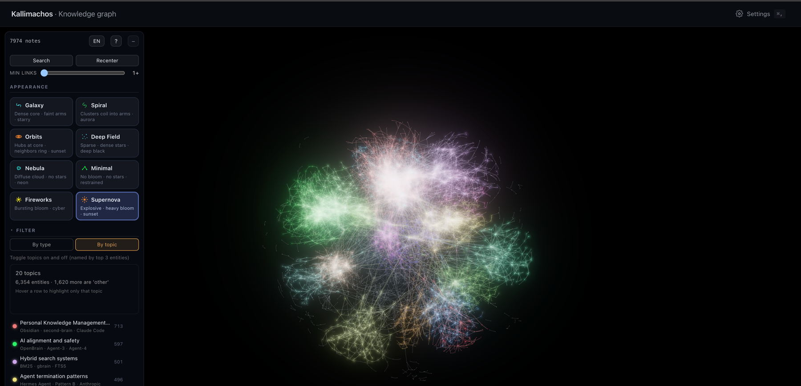
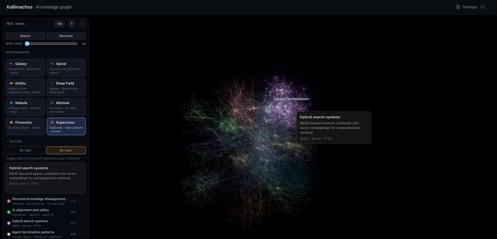

<h1 align="center">Kallimachos</h1>

<p align="center">
  <strong>Give Claude a memory of everything you wrote.</strong><br/>
  Your Obsidian vault — and, if you want them, your Claude Code sessions — become one knowledge graph, served over MCP with a source behind every answer.
</p>

<p align="center">
  <a href="#quick-start">Quick start</a> ·
  <a href="#the-mcp-tools">MCP tools</a> ·
  <a href="#the-galaxy-view">Galaxy view</a> ·
  <a href="#how-it-works">How it works</a> ·
  <a href="#what-stays-on-your-machine">Privacy</a> ·
  <a href="docs/">Docs</a> ·
  <a href="LICENSE">AGPL-3.0</a>
</p>

<p align="center">
  <a href="https://github.com/HwangTaehyun/kallimachos/blob/main/LICENSE"></a>
  <a href="https://github.com/HwangTaehyun/kallimachos/releases"></a>
  <a href="https://kallimachos.dev"></a>
</p>



<p align="center"><em>The author's actual vault, rendered by the viewer on 2026-09-01: 7,974 entities, one colour per topic. The same vault yielded 24,640 on 2026-09-04, of which 15,763 fall into the 20 topics and 8,877 into none — clustering names the dense parts of a graph, it does not partition it.  Topics are found by community detection and named from their top entities. The <a href="#try-it-on-the-demo-vault">demo vault</a> in this repo reproduces a smaller graph end-to-end.</em></p>

## What is this, really?

Kallimachos is a **local pipeline plus an MCP server** for your own writing. It scans a folder of Markdown — an Obsidian vault, plus your distilled Claude Code session logs — and extracts **entities and relations** into a searchable graph (LanceDB: BM25 + multilingual embeddings + entity/relation vectors, fused with measured weights).

Then it hands that graph to Claude over MCP. When you ask *"what did we decide on auth in that March review?"*, the answer comes back **with the documents it came from**. Every entity and relation response carries `docs` and `refs`, so you can open what it cited and check it.

Extraction runs **on your machine, on your own Claude subscription** (`claude -p`). Indexing, embeddings and search are fully local. Nothing requires a server.

## Why not just let Claude grep your notes?

Because grep hands the problem back. Measured on the author's 1,128-note vault,
2026-09-14, for *"why did this project choose AGPL-3.0?"* — grepping the string the
question itself names, `AGPL-3.0`:

| | Claude greps the vault | Claude asks Kallimachos |
|---|---|---|
| First response | 31 matching lines across 14 files, ~3,600 tokens | 20 relations, ~3,500 tokens |
| Is that the answer? | No — it must now pick and read them: ~2,000 tokens for a typical file, but one of the 14 is a 390 KB generated index | Yes — the relations are already facts |
| What else was considered? | You must already know the names to grep for | Returned alongside the answer |

**The sizes are a wash.** That is the point: grep is not expensive, it is *unfinished*. It
returns the lines that matched and leaves Claude to decide which of the 14 files holds the
reasoning — and reading even one of them costs more than the whole catalogue answer did.

> Reproduce it with `grep -r "AGPL-3.0" <vault> --include='*.md'` and `kal_neighbors("AGPL-3.0")`.
> ⚠ Grep the **same string the question names**. An earlier version of this table reported
> "106 lines across 34 files" — those came from grepping the looser `AGPL`, not `AGPL-3.0`,
> so the two columns were not answering the same question (deep review 2026-09-13).

What comes back from the catalogue is the reasoning itself:

```
$ kal_neighbors("AGPL-3.0")

AGPL-3.0
  kallimachos                     chose AGPL-3.0 because hosting services …
  CLA                             copyleft necessitates a CLA to retain re-licensing rights
  Permissive open-source license  AGPL-3.0 copyleft creates different contribution mechanics
  open-source exemption policy    AGPL-3.0 projects automatically qualify
  Plausible Analytics             uses AGPL-3.0 — real-world evidence for the choice
```

Nothing is being searched. Extraction has already read every note and written down what it
found, so this is a lookup that returns facts rather than a ranking that returns files.
That is why one call ends it.

And naming one thing you remember is enough. `kal_neighbors("Kallimachos")` on this
repository returns, among others, `Electron` — *"previously implemented in Electron"* — and
`CLA` — *"required from all contributors"*. Neither is something you could have searched
for, because forgetting them is the reason you are asking.

## The rest of what it does

- **Session logs become part of the graph** — a distilled Claude Code conversation is indexed
  next to your notes, so an answer can cite a decision you never wrote down as a note.
- **Every answer carries its sources** — entity and relation responses include `docs` and
  `refs`, so you can open what it cited and check it.
- **`kal_timeline`** lists what was written about an entity and when — less than the name
  suggests, and it is worth knowing why before you rely on it. The change verdict has only
  ever run on entities carrying eight or more description fragments (**3.4% of them**), so a
  `change_count` of 0 means *either* "it did not change" *or* "it was never assessed", and the
  schema cannot tell those apart. Events also carry the date the bundle was built when the
  original date is unknown, so a run of identical dates is an artefact, not a finding. Read
  `events`, not the count. (An earlier version of this paragraph blamed sparsity — entities
  "described once" — which was a second wrong explanation for the same observation; measured
  2026-09-13.)
- **Korean queries work** — multilingual-e5-small embeddings layered with a 2·3-gram full-text
  index, so a question finds the note even when it never uses that spelling. The full-text half
  is what keeps Korean working when the embedding half misses.
- **A galaxy view** renders entities as stars and relations as edges, grouped by topic — useful
  for spotting a cluster you forgot you had.

## A look inside

Real output, from the demo vault in this repo (`docs/demo-vault/`), on a cold database:

```
$ python src/kal_search.py "why did we choose session cookies over JWT" --snippets

   1. [0.936] 📓 wiki/auth-decision.md
   2. [0.935] 💬 raw/conversations/sessions/2026-03-14-auth-review.md
   3. [0.599] 📓 wiki/redis-sessions.md
   4. [0.524] 📓 wiki/redis-eviction.md
   ...

  › wiki/auth-decision.md
    Auth decision — signed session cookies … JWTs cannot be revoked after issue
    without a denylist, which reintroduces server state …
  › raw/conversations/sessions/2026-03-14-auth-review.md
    Session — auth design review … JWT denylist adds a Redis lookup per request
    anyway, erasing the stateless benefit. Signed HttpOnly cookies with
    SameSite=Lax chosen …
```

The decision note and the **conversation where the decision actually happened** arrive one point apart at the top: relation vectors (weight 0.59 in the default profile) pull both up. See [`docs/HYBRID_METHODOLOGY.md`](docs/HYBRID_METHODOLOGY.md) for how the weights were measured.

## Status

| ✅ Works today | 🚧 Being wired up | 💭 Strong opinions, pending code |
|---|---|---|
| Index · hybrid search · CLI | Prebuilt image on GHCR (`docker pull`) | Multi-vault comparison |
| Entity/relation extraction via your `claude` CLI | | Graph-aware note suggestions |
| Claude Code **MCP plugin** (5 tools, containerised) | | |
| Hosted remote MCP at [kallimachos.dev](https://kallimachos.dev) | | |
| Obsidian **galaxy view** plugin + web build | | |
| Local web UI (Docker) | | |
| Codex / other MCP clients | | |

## Quick start

**Requirements:** Python 3.11+, [`uv`](https://docs.astral.sh/uv/) and [`just`](https://github.com/casey/just) — every path below starts with a `just` recipe. Docker for the web UI and the MCP plugin. The `claude` CLI for the extraction step **and** for installing the plugin.

> ⚠ **Indexing is not extraction.** `schema_v3.py` builds chunks and the search index; it creates
> the entity and relation tables **empty**. `kal_search` and `kal_doc` work at that point, but
> `kal_entity`, `kal_neighbors` and `kal_timeline` answer `name_not_found` until you run the
> extraction step — and those three are what the graph examples above show. Extraction calls
> your own `claude` CLI, so it runs on your machine, not in the container: Path A and Path C
> both need the Path B setup for that one step.
>
> ⚠ **And the order is extract → index, not the other way round.** `just run extract` writes
> `~/.kal/lr_kg.json` and touches no table; `index` is the step that reads that file and fills
> `lr_entities` / `lr_relations` (`src/status.py:416-425`). Extracting after you index leaves
> the tables exactly as empty as before, which is the shape this warning exists to prevent.

### Path A — Claude Code plugin (recommended)

The repository is itself a Claude Code plugin, and the MCP server runs containerised with the
embedding model baked in — no Python, no network at query time, and a hardened server surface.

> ⚠ This path used to say "nobody has to install Python or a 1.1 GB venv". That is no longer
> true and was never true for anyone who wanted a graph: step 2 is `just setup`, which is
> `uv sync` — the venv, torch and all. **Containerising the server does not containerise the
> one-time graph build**, because extraction calls your own `claude` CLI. Path A is Path B plus
> Path B with the index and the server containerised; pick Path B if you would rather not run
> Docker at all.
> (deep review 2026-09-14 round 2, completeness lens)

```bash
git clone https://github.com/HwangTaehyun/kallimachos.git kal && cd kal

# 1. Build the image (until it is published on GHCR, build locally — same tag the manifest expects)
just build-kal && docker tag kal:local ghcr.io/hwangtaehyun/kal:0.1.2

# 2. Set up the pipeline on your machine.  Extraction (step 3) calls your own `claude` CLI,
#    so it cannot run in the container — Path A needs this much of Path B.
#    ⚠ `just setup` refuses to run without a vault — it will not guess, because a wrong
#      guess indexes your whole home directory and sends it through `claude -p`. Pass it on
#      the command line; `just vault` then records it for the containers too.
mkdir -p ~/.kal
KAL_VAULT=/path/to/vault just setup
just vault /path/to/vault

# 3. Extract entities and relations.  Writes ~/.kal/lr_kg.json.  Shows the estimated cost
#    and asks before running.
just run extract

# 4. Index.  Chunks and embeds the vault AND merges step 3's output into the graph tables —
#    ⚠ THE ORDER MATTERS.  `extract` writes a file; `index` is what actually fills
#    lr_entities / lr_relations by reading it (src/status.py:416-425).  Index before you
#    extract and the graph tables are created **empty**, so kal_entity, kal_neighbors and
#    kal_timeline answer name_not_found — with nothing on screen to say why.
#    --user must match step 5's run_as, or the plugin reads an index it cannot see:
#    empty results, no error.  The image's own user is 1000:1000; macOS is usually 501:20.
docker run --rm --user $(id -u):$(id -g) -v ~/.kal:/data -v /path/to/vault:/vault:ro \
  ghcr.io/hwangtaehyun/kal:0.1.2 src/schema_v3.py

# 4b. OPTIONAL — bring your Claude Code session logs into the same graph.
#     ⚠ This is the second half of this README's opening sentence, and **no path runs it for
#       you.**  Without it you get a vault-only graph and the session half silently never
#       happens (deep review 2026-09-14 round 3).  It reads ~/.claude/projects, calls an LLM
#       (so it costs money and shows the estimate first), writes distilled documents into the
#       vault, and needs one more index pass to reach the graph.
just run distill             # ~/.claude/projects → ~/.kal/distilled   (LLM)
just run promote             # → vault raw/conversations/sessions/
docker run --rm --user $(id -u):$(id -g) -v ~/.kal:/data -v /path/to/vault:/vault:ro \
  ghcr.io/hwangtaehyun/kal:0.1.2 src/schema_v3.py      # index again to pick them up

# 5. Register and install the plugin — paths are yours, so they are asked for
claude plugin marketplace add /path/to/kal
claude plugin install kal@kallimachos \
  --config vault_dir=/path/to/vault \
  --config kal_dir=$HOME/.kal \
  --config run_as=$(id -u):$(id -g)

# 6. Verify
claude mcp list | grep kal        # → ✔ Connected
```

> ⚠️ `run_as` defaults to `1000:1000`; macOS is usually `501:20`. If it doesn't match, mounted folders are unreadable and you get **empty results, no error**.

### Path B — CLI pipeline on the host

```bash
git clone https://github.com/HwangTaehyun/kallimachos.git kal && cd kal
just init                    # TUI: pick your notes folder, see the cost, index to searchable
```

Or by hand:

```bash
KAL_VAULT=~/my-notes just setup   # uv sync + .env (~64s cold, idempotent).  It will not
                                  # guess the vault, so give it here on a fresh clone.
just vault ~/my-notes             # tell CLI *and* containers where the notes live
just run index               # docs → chunks → vectors → inverted index  (~seconds)
just search "that auth decision"
```

`just run extract` then enriches the graph with entities and relations — it calls your local `claude` CLI, shows the estimated cost first, and asks before running. `just status` always tells you what is stale and what to run next.

### Path C — Docker only

```bash
# ⚠ FIRST, and not later: docker-compose.kal.yml interpolates ${VAULT_DIR:?…} at config-parse
#   time, so on a clone with no .env **even `build` aborts** with "VAULT_DIR is not set".
#   These two write .env and ~/.kal/config.json; nothing below runs without them.
KAL_VAULT=/path/to/vault just setup
just vault /path/to/vault

docker compose -f docker-compose.kal.yml build
docker compose -f docker-compose.kal.yml run --rm kal src/schema_v3.py     # index
docker compose -f docker-compose.kal.yml run --rm kal src/kal_mcp.py --selftest

# ⚠ `extract` writes a file; `index` is what reads it and fills the graph tables, so the
#    index above does not count — you must index again *after* extracting.
just run extract             # entities + relations (your `claude` CLI, on this machine)
docker compose -f docker-compose.kal.yml run --rm kal src/schema_v3.py     # re-index to merge
just up                      # local web UI → http://127.0.0.1:5173
```

The embedding model is baked into the image — no network needed at runtime.

### Try it on the demo vault

Everything above works on the synthetic demo vault in [`docs/demo-vault/`](docs/demo-vault/) — 36 notes about a fictional search-infrastructure project, which extract into ~304 entities and 360 relations.

⚠ The two commands below **index and search only**. They do not extract, so the ~304 entities
are not what they produce and the ranking shown earlier — which leans 0.59 on relation vectors —
is not the ranking they run. To reproduce that output, run `just run extract` between them and
index again. (Caught 2026-09-14 round 3: this block contradicted the pre-extraction note above.)

```bash
KAL_VAULT=$PWD/docs/demo-vault KAL_HOME=/tmp/kal-demo .venv/bin/python src/schema_v3.py
KAL_VAULT=$PWD/docs/demo-vault KAL_HOME=/tmp/kal-demo .venv/bin/python src/kal_search.py "session cookies" --snippets
```

## The MCP tools

| Tool | When | Ceiling |
|---|---|---|
| `kal_search(query, top?, origin?, mode?)` | You don't know what you're looking for. The main entry point. | `top` ≤ 50 |
| `kal_entity(name, as_of?)` | What a known name is + sources + how it changed. **Not** what it is connected to. | 10 docs (`doc_ids_all` carries the rest) |
| `kal_timeline(name, since?, until?)` | "When did this change, and how" — with original wording. | 20 events |
| `kal_neighbors(name, min_degree?, limit?)` | One hop of the graph around an entity — the connected names and the relation text. | **20 relations, hard.** `neighbor_total` says how many exist |
| `kal_doc(doc_id, max_chars?)` | Verify a citation — the original document. | `max_chars` 200–20,000, default 4,000 |

`kal_search` takes a **ranking mode**, and which one you pick changes what comes back:

| `mode` | Weights (bm25 · chunk · entity · relation) | Reach for it when |
|---|---|---|
| `default` | .18 · .05 · .18 · .59 | the question is about a topic or a decision |
| `keyword` | 1 · 0 · 0 · 0 | the user quoted an exact string — a flag, an error, an identifier |
| `graph` | .20 · 0 · .30 · .50 | you want the reasoning, not the wording |
| `vector` | 0 · 1 · 0 · 0 | the wording is certainly different from the notes |

**Before extraction, search is weaker than it looks.** The `default` ranking is
`.18 · .05 · .18 · .59` — nearly four fifths of it comes from the entity and relation halves.
Until the extraction is merged, those tables are empty and contribute nothing, so what you are
actually running is BM25 plus chunk vectors. `kal_search` works; it just is not the ranking
these numbers were tuned for.

**When a tool finds nothing.** `kal_search` returns `hit_count: 0` with no `error` — that is a
successful search that matched nothing, and the response says which ranking was used so you can
retry under another. The name-based tools return `{"error": "name_not_found", "candidates": [...]}`
when the name is close to something, and say so plainly when it is not: resolve the name with
`kal_search` first. A malformed date gives `bad_date`, an unknown `origin` or `mode` gives
`bad_origin` / `bad_mode` with the accepted values. **An out-of-range integer is clamped
silently** — if you asked for 100 neighbours and got 20, the cap is why, and `neighbor_total`
tells you what is beyond it.

Every entity/relation response carries its sources (`docs` — path, title, date). External references (`refs`) ride when the entity has any that resolve; `refs_status` says `none`, `unresolved` or `ok`, and `refs_unresolved` counts the ones recorded but not resolvable, which are omitted rather than handed over as dead citations. `kal_search` and `kal_doc` return `docs` but not `refs`. One rule for time arguments: `as_of` = the **state** at a moment; `since`/`until` = the **list of changes** in a range.

```bash
python src/kal_mcp.py --selftest    # exercises all 5 tools + boundary checks
```

> ⚠ **The installed plugin serves a pinned image, not your working tree.** `claude plugin
> install` copies the manifest into `~/.claude/plugins/cache/<marketplace>/<plugin>/<version>/`
> and that copy pins an image tag. Editing `src/` changes nothing a model sees until you
> rebuild the image *and* reinstall the plugin — and a cached copy from an older version keeps
> pinning the older tag. If a tool's behaviour does not match this README, check which tag the
> cached `.mcp.json` names before debugging the code.

## The galaxy view

The Obsidian plugin (`plugin/`, a fork of [galaxy-view](https://github.com/longwind1984/galaxy-view)) adds an **entity graph mode**: nodes are entities, not pages; edges are relations; clicking a star shows its description, relations and source documents. The same source also builds a standalone, single-file `galaxy.html` you can open in any browser:

```bash
python src/export_kal_graph.py            # graph → .obsidian/plugins/kal-galaxy/kal-graph.json
cd plugin && npm install && node esbuild.web.mjs      # → viewer/galaxy.html (self-contained)
```

Entities are **grouped into topics** automatically: Louvain community detection finds the dense clusters (20 of them in the vault above; the entities in none of them stay in an *Other* bucket rather than being forced into one), and a model names each topic from its three most connected entities. Hover a topic and only that cluster stays lit, with its summary beside it.



## How it works

```
 your vault (*.md)          ~/.claude/projects (session logs)
      │                            │  distill (LLM, local)
      ▼                            ▼
   scan → chunk (500 chars) → embed (e5-small, local) → BM25 n-gram index
      │
      │  lr_extract — the ONLY step that calls an LLM,
      │  via YOUR `claude` CLI on YOUR machine
      ▼
   entities + relations ──► LanceDB (~/.kal/db, chmod 700)
      │                          │
      ▼                          ▼
   galaxy view            MCP server (stdio) ──► Claude Code / Codex
                                                   answers + docs + refs
```

- **Hybrid retrieval** — BM25, chunk vectors, entity vectors and relation vectors fused with weights measured against 991 judged pairs ([methodology](docs/HYBRID_METHODOLOGY.md), including its honest limits).
- **stdio only** — the MCP server never opens a network listener ([`docs/STACK.md`](docs/STACK.md) §7 explains why that boundary exists).
- **Incremental** — `just run sync` re-indexes only changed documents in seconds; `just status` knows what's stale.

## Bringing your own knowledge in

Two sources, one destination. Kallimachos gathers both into an **openwiki bundle** —
[OKF v0.2](https://github.com/GoogleCloudPlatform/open-knowledge-format) plus three extension keys
(`no_llm`, `doc_type`, `why_captured`) — and indexes that.

```
  agent session logs  ──distil (LLM)──┐
  ~/.claude · ~/.codex                │
                                      ├──►  openwiki bundle  ──►  knowledge DB
  any tree of Markdown ──convert──────┘     personal/**            ~/.kal/db
  an Obsidian vault, a docs folder
```

```bash
just openwiki-sessions                    # session logs → distilled documents → the bundle   (LLM)
just openwiki-vault <bundle> <vault>      # any Markdown tree → the bundle.  No LLM, seconds
just openwiki-enrich <bundle>             # fill the OKF metadata conversion could not invent  (LLM)
just openwiki-index                       # the bundle → the knowledge DB.  No LLM
just openwiki-kg                          # its documents → entities and relations             (LLM)
just openwiki-adopt                       # point the CLI · MCP · container at the bundle
```

**Building the knowledge DB calls no LLM.** Verified by running the indexer with `claude` absent
from `PATH` and the relay unset — it completes. Only distillation, metadata filling and graph
extraction need a model, which is why they are separate commands ([`docs/DOCKER-SETUP.md`](docs/DOCKER-SETUP.md) §5b
lists exactly which settings each needs).

The vault half calls no LLM and takes seconds; the session half needs one and takes hours. They are
separate commands because they fail for entirely different reasons —— a rate limit should not stop a
conversion that never needed the network.

Distillation keeps what a conversation **arrived at**, not what was said along the way: a thread
becomes a document only once it closed, and a claim that was overturned becomes a `correction`
document explaining what replaced it and why. On the reference corpus that is 42% of the output —
430 documents of a shape the older window-splitting prompt produced **none** of.

Conversion never invents metadata, so a migrated vault page keeps only the keys its author wrote
(measured before enrichment: 17% had `doc_type`, against 100% of the distilled ones;
`openwiki-enrich` has since brought those 96 migrated pages to 100%, and the bundle as a whole to
1,115 of 1,118 on 2026-09-04 — the three without one are the bundle's own `README.md` and the two
vendored files under `references/` (`README.md`, `okf-SPEC-v0.2.md`), which are scaffolding
rather than content). `openwiki-enrich` fills the
rest with an LLM and stamps `filled_by:` on the page, so what a model proposed stays visible and
correctable.

Full walkthrough, with the measured costs and the traps: [`docs/OPENWIKI-PIPELINE.md`](docs/OPENWIKI-PIPELINE.md).

## What stays on your machine

Everything, unless you say otherwise. Two steps can send note content off your machine, and both are yours to run:

- **Extraction** goes through your own `claude` CLI subscription —— never to a server of ours.
- **`just push`** uploads an export of the index (`~/.kal/db`) to the cloud you point it at. The export holds every *non-gated* note's body in 500-character pieces (what search returns) and the entities and relations —— it is not "just the graph". The hand-rolled BM25 tables (`ix_*`) stay home; the copy carries its own full-text index. It does **not** hold your documents' absolute paths or the vault path (`src/export_cloud.py` blanks and drops them). Nothing is pushed unless you run it, and `just status` tells you when the cloud copy is behind.

- `no_llm: true` in a note's frontmatter keeps that note out of extraction entirely (still indexed and searchable locally). If you `just push`, that note goes up as a stub —— its id and the flag, no path, title, or text —— so the remote MCP can keep filtering anything derived from it; its body pieces and search rows stay on your machine.
- `KAL_NO_LLM=Private:work/Finance` blocks whole folders, matched as path components from the vault root. Since 2026-09-05 the path rule is resolved **at index time** into the same `no_llm` mark the frontmatter sets, so the local MCP, `just push` and the remote MCP all honour it —— before that only extraction did (an index built earlier needs `just run index` or a sync to pick it up).
- The optional [hosted service](https://kallimachos.dev) exists for people who want the same graph on every device; the self-hosted pipeline is complete without it.

  What actually differs — the tools are the same five either way:

  | | Self-host | Hosted |
  |---|---|---|
  | Where it answers from | the machine running it, while that machine is on | anywhere, including while your laptop sleeps |
  | stdio MCP (Claude Code) | ✅ | ✅ |
  | Remote MCP (claude.ai · phone · ChatGPT · Gemini) | — | ✅ |
  | Web UI · galaxy view | ✅ | ✅ |
  | Extraction | your machine, your `claude` CLI | **same** — extraction never moves |
  | What leaves the machine | nothing but what you `just push` | entity names, relations, and the 500-character pieces search returns |
  | Licence | AGPL-3.0 | AGPL-3.0 |

  Pricing is on the [site](https://kallimachos.dev) — deliberately not duplicated here, because a
  number in two places is a number that will disagree with itself.

### The relay — when the container needs an LLM

On **macOS**, mounting `~/.claude` into a container brings the settings but **not the login**: the
credentials live in the keychain. So `claude` cannot run inside the container, and the API blocks
those steps with a **412 before they start** rather than failing chunk by chunk for half an hour.

The relay is the way around it — a small HTTP server **on the host** that runs `claude -p` on the
container's behalf and returns text.

```bash
just relay          # on the host.  It prints the two values below
```

```
  claude relay → http://127.0.0.1:8791   at most 8 concurrent
  KAL_RELAY_TOKEN=<generated>

  Values for the container side (.env):
    KAL_CLAUDE_RELAY=http://host.docker.internal:8791
    KAL_RELAY_TOKEN=<the same value>
```

| | |
|---|---|
| `KAL_CLAUDE_RELAY` | where the container looks for the relay. Set it and LLM calls go to the host; leave it empty and `claude` is launched inside the container |
| `KAL_RELAY_TOKEN` | the relay's only authentication. Generated on startup if you do not supply one — set it in `.env` first to keep it stable across restarts |

**You do not need any of this** when the pipeline runs on the host (`just openwiki`, `just openwiki-kg`),
which is how the reference corpus was built. On a **Linux** host the credentials are a file, the
mount is enough, and there is no relay either.

What the relay will not do:

- It binds `127.0.0.1`. Opening it outward is an unauthenticated LLM execution channel for the
  whole network.
- It never touches the DB. It takes a prompt and returns text, which keeps the container the
  single writer of LanceDB.
- Tools are blocked. Running tools on someone else's machine is the opposite of this channel's
  purpose.
- It is **not** a Compose service, on purpose: putting it in the container would bring the
  authentication problem it exists to solve.

## Docs

| | |
|---|---|
| [`docs/ARCHITECTURE.md`](docs/ARCHITECTURE.md) | C4 diagrams + per-use-case sequences |
| [`docs/OPENWIKI-PIPELINE.md`](docs/OPENWIKI-PIPELINE.md) | Sessions **and** any Markdown tree → an OKF bundle → the DB |
| [`docs/PIPELINE.md`](docs/PIPELINE.md) | Steps 1–7, caches, what to re-run when |
| [`docs/ERD.md`](docs/ERD.md) | Schema, key design, integrity constraints |
| [`docs/HYBRID_METHODOLOGY.md`](docs/HYBRID_METHODOLOGY.md) | How search quality was measured — and its limits |
| [`docs/CONNECTING-AGENTS.md`](docs/CONNECTING-AGENTS.md) | Hooking the graph to Buzz, Hermes and other MCP clients |
| [`docs/DOCKER-SETUP.md`](docs/DOCKER-SETUP.md) | Container setup in order — .env, the relay, changing the vault, what breaks |
| [`docs/STACK.md`](docs/STACK.md) | Container/relay operations, security review |

## What it is not

- **Not a notes app.** Your Markdown stays yours, wherever it already lives. Indexing, search and
  the graph only ever read it. One step writes: `promote` moves the distilled session documents
  into the vault and commits them, which is the whole point of that step — `status.py`'s
  `writes_vault` flag marks it, and the web UI asks before running it.
- **Not cloud-required.** The pipeline, search, MCP and galaxy view are complete on one machine, offline after setup.
- **Not magic.** Extraction quality depends on your notes; the eval harness and its blind spots are documented, not hidden.

## Contributing & licence

Contributions welcome — see [`CONTRIBUTING.md`](CONTRIBUTING.md) (CLA is one click via a GitHub bot; [`CLA.md`](CLA.md) explains why it exists).

**AGPL-3.0-only** (© 2026 Taehyun Hwang), with one exception: [`plugin/`](plugin/) remains **MIT** (© 2026 Rick, the upstream [galaxy-view](https://github.com/longwind1984/galaxy-view) author).
