# Architecture — kallimachos

## Overview

A system that pulls entities and relations out of a vault's 376 markdown documents with an LLM,
puts them in LanceDB, and runs and shows the result on the web.  The only channel off the machine
is the Claude API; embedding, indexing and search are all local.  Only the LLM call goes through a
relay on the host —— that is what lets the container use the macOS keychain credentials while keeping a single writer on the DB.

---

## 1. High-Level Integration (Component Diagram)

### 1a. C4 L1 — system context

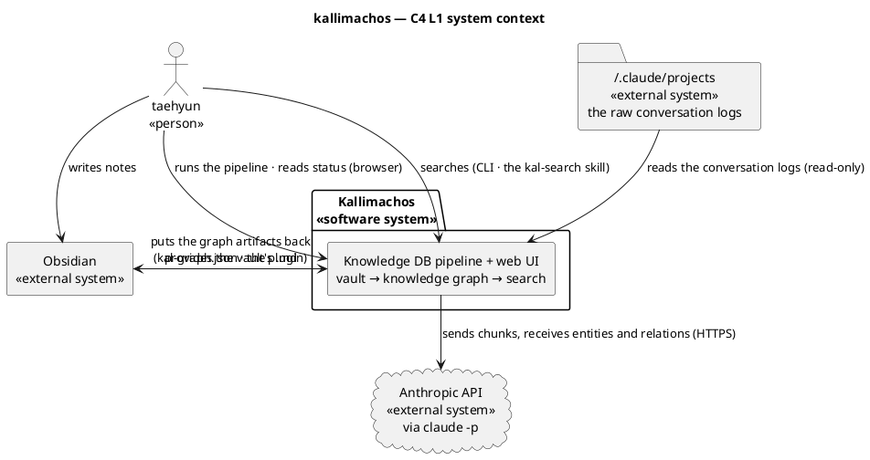

- **Read this node first** — the vault is both the input and the output.  A person writes notes,
  and the system puts the graph artifacts back inside the same vault.
- **The most important edge** — `SYS --> AN` is the single channel off the machine.  Embedding,
  BM25 and search are all local, so search keeps working when that line is cut.
- **The surprise** — the session logs (`~/.claude/projects`) are **a first-class input** alongside
  the vault.  278 of the 376 documents came from there.

### 1b. C4 L2 — containers

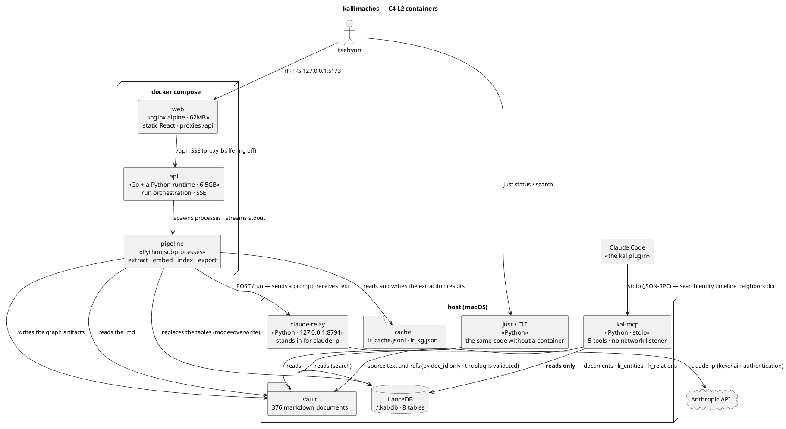

- **Read this node first** — `PIPE` is the only thing that writes to `LANCE`.  The relay is a
  pure text function that knows nothing of the DB, so there stays exactly one writer.
- **The most important edge** — `PIPE --> RELAY`.  That one hop is what lets the container use
  the LLM without credentials of its own.  macOS keeps them in the keychain, so mounting `~/.claude` fails.
- **The surprise** — `CLI` and `API` call **the same Python code**.  The container exists for the
  web UI; it is not a premise of the pipeline.
- **`MCP` is the second transmission boundary** — `SKIP` decides "index this locally?" and
  `no_llm` decides "send this off the machine?".  MCP is where what was indexed is opened to an
  LLM, so it re-reads `no_llm` on every query.  Derived text (`description`, `timeline`) has to
  be blocked too —— filtering the document list alone leaves **sensitive sentences with no source**.
- **The risk** — flock does not cross the container boundary (measured).  Overlap a host
  `just index` with a web run and the same LanceDB is overwritten concurrently and **silently corrupted**.
- **`MCP` does not write** — being read-only, it takes no part in that race.  Its cache is dropped
  by `fresh()` on the mtime of `documents.lance/_versions`, so **no restart is needed.**  (The
  older version watched the directory's mtime and sat 3.3 days stale, measured —— files only ever
  accumulated below it.  An in-place update that does not move the mtime is still missed.)

---

## 2. Incepto-Side Infra Usage

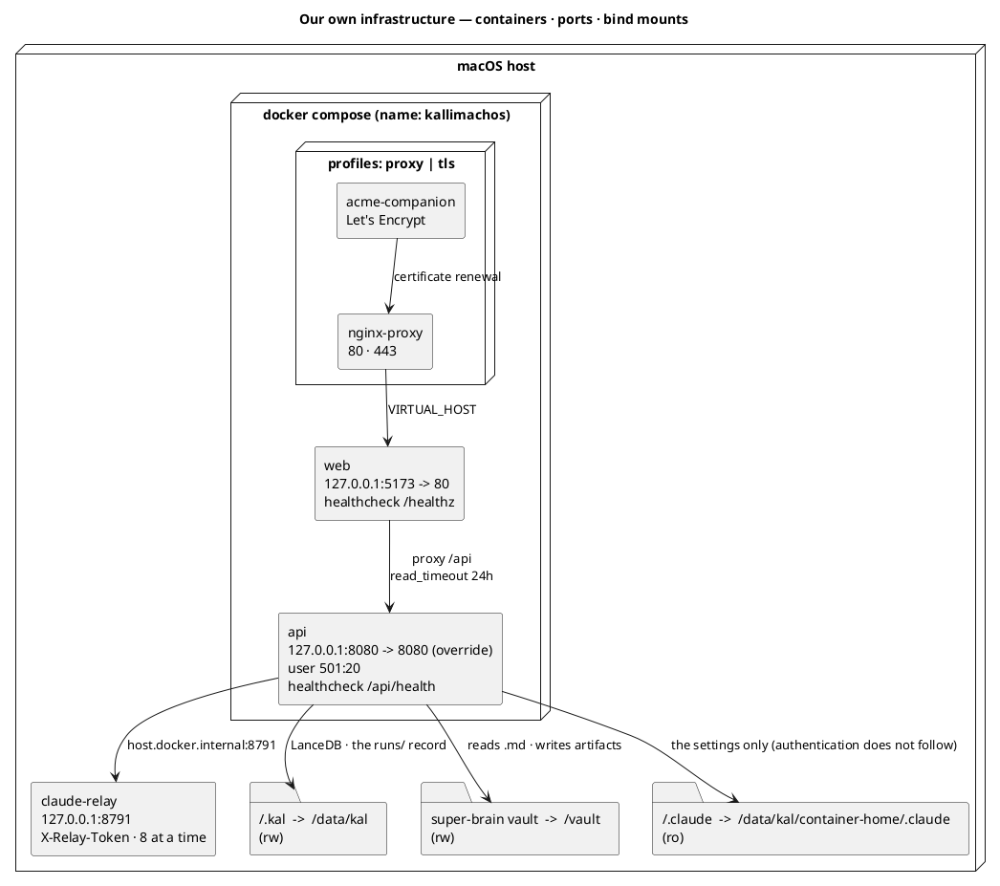

- **What is owned locally** — the data sets (`~/.kal` and the vault) are all host files, bind
  mounted.  Not wrapped in volumes because they outlive the container and Obsidian writes them too.
- **The ports and mounts that matter** — every published port is on `127.0.0.1`.  That is
  **because there is no authentication**.  Opened on `0.0.0.0`, anyone on the same network could
  run the pipeline and edit the vault.  In the default composition two are published to the host:
  `web` (5173) and `api` (8080, from the override).  That invariant is now **pinned by a check**
  —— guard ⑨ in `status.py --selftest` confirms every published port across `docker-compose*.yml`
  is either `127.0.0.1:` or `${VAR:-127.0.0.1}`.  A human eye used to be the only defence, and
  the `proxy` profile really did sit there bypassing the rule wholesale with `"80:80"` (2026-08-21).
- **Shared vs isolated** — `HOME` is `/data/kal/container-home`.  The image's `/home/app` is
  owned by uid 1000 while the container runs as `.env`'s UID (501 on macOS), so it could not even be entered.
- **Optional** — the `proxy` and `tls` profiles do not start by default.  Turn them on only for a domain.

---

## 3. End-to-End Sequence (Sequence Diagram)

The representative request — **pressing "extract the knowledge graph" on the web**.  It involves more moving parts than anything else here.

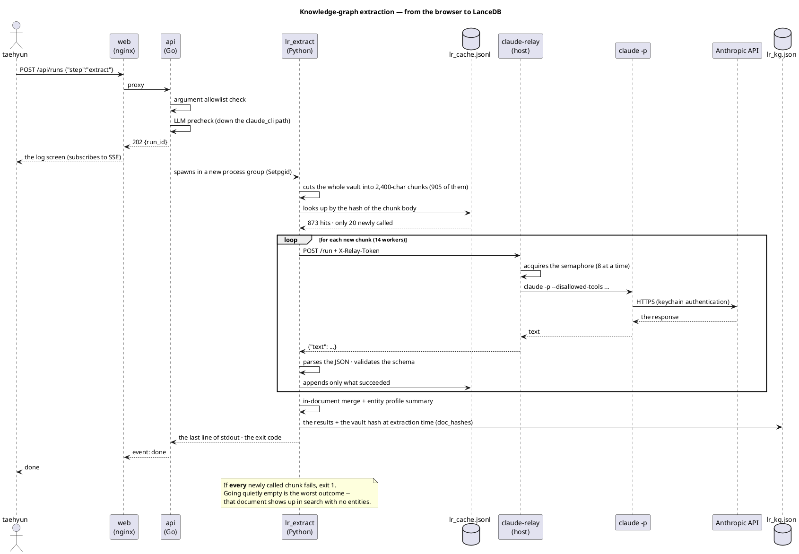

- **The trigger** — the run button in the browser.  The API returns 202 at once and the real work
  runs behind it.  Not holding a terminal hostage is why the web UI exists.
- **Where it blocks** — the semaphore in `RELAY` (8 at a time).  Without it, 14 workers put 14
  claude processes straight onto the host.
- **The final durable write** — `lr_kg.json`.  That alone does not reach search; an index rebuild
  then has to read this file into LanceDB.
- **The cache is most of the value** — 873 of 905 are skipped.  The cache key is the hash of the
  chunk body, so an unchanged chunk never calls the LLM.

---

## 4. Service Dependency Map (Service Catalog)

### 4a. C4 L3 — inside the api container

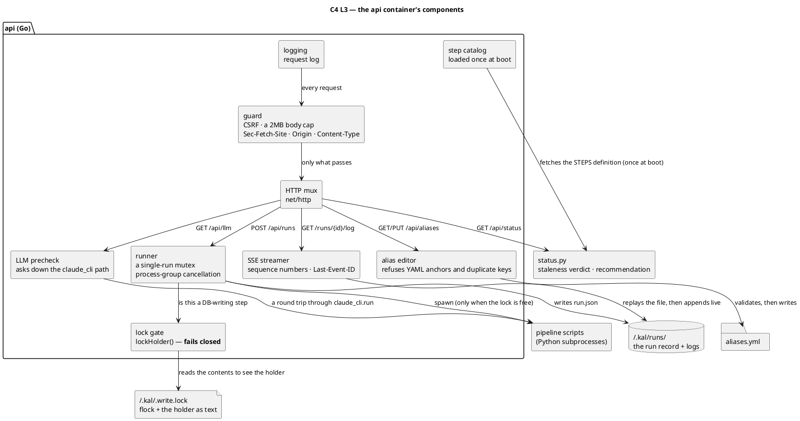

- **The root node** — now `LOG → GRD`, not `MUX`.  `guard` was once defined and then left
  unwired as `Handler: logging(mux)`, and because Go **does not treat an unused function as an
  error** the build passed cleanly.  It was grep that found it, not the compiler.
- **The most important dependency** — `STEPS --> STAT`.  The pipeline step definitions live in
  `status.py` alone.  A copy on the Go side would inevitably drift, so it is fetched at boot.
- **The node that has to fail closed** — `LOCK`.  Treat **unreadable** and **absent** the same
  and it passes as "no lock", putting two writers on the DB.  Only an absent file counts as
  normal (2026-08-21).
- **The branch** — `PROBE` splits relay/local on whether `KAL_CLAUDE_RELAY` is set.  Calling
  `claude` directly always says "Not logged in" in a container, closing the gate wrongly.

### 4b. Service dependencies — the whole picture

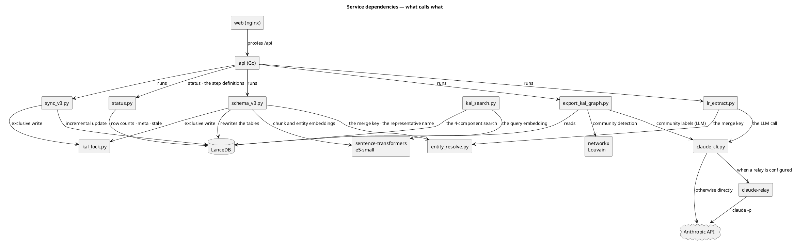

- **The root node** — `api`.  Except that `kal_search` does not go through the API at all: the CLI and the skill read the DB directly.
- **The riskiest external dependency** — the `Anthropic API`.  Cut it and extraction, distillation
  and community labelling stop.  Search and indexing carry on.
- **The common foundation** — `entity_resolve.py` is used by **both** extraction and indexing.
  Let the merge key drift and relations point at entities that do not exist.
- **The optional branch** — `claude_cli --> RELAY` only when `KAL_CLAUDE_RELAY` is set.

---

## 5. Data Flow Through Storage (Data Flow Diagram)

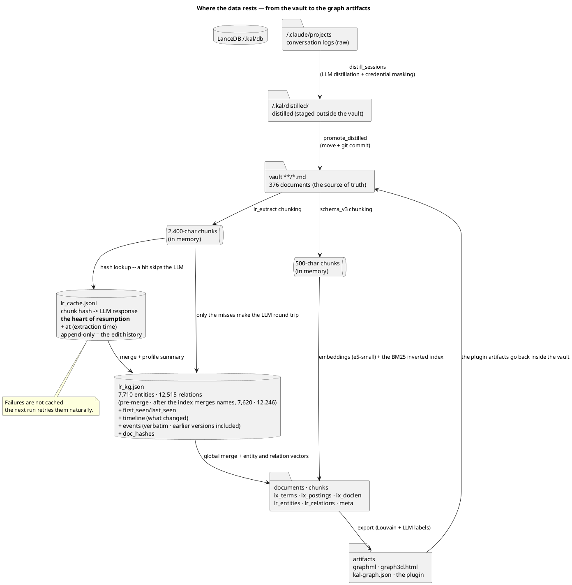

- **Where it first lands** — `~/.kal/distilled/`.  Built **outside** the vault first.  It enters
  the vault only after passing masking verification.
- **Persisted** — the vault's `.md` is the source of truth and LanceDB is a derivative that can be
  regenerated in full.  That is why old LanceDB versions can be cleaned, and a rebuild does clean them.
- **Reruns and idempotency** — `lr_cache.jsonl` is keyed on the chunk body hash, so an unchanged
  chunk never calls the LLM again.  A full re-extraction is needed only when the chunk size or the prompt changes.
- **Watch the feedback loop** — the artifacts come back inside the vault.  That is why
  `schema_v3.SKIP` excludes `/kg/` — otherwise a KG→note→KG cycle forms.
- **The two chunkings never meet** — 2,400 and 500 chars have strides (2,200 vs 450) that do not
  divide, so no boundary lines up.  `chunk_ids` used to reconstruct that after the fact, but
  nothing read it and it was removed on 2026-08-19.  Search joins on `doc_ids` instead.

---

## Appendix A — sequences by use case

§3 covered the representative path (extraction).  The remaining use cases are below.

### UC1 — checking status

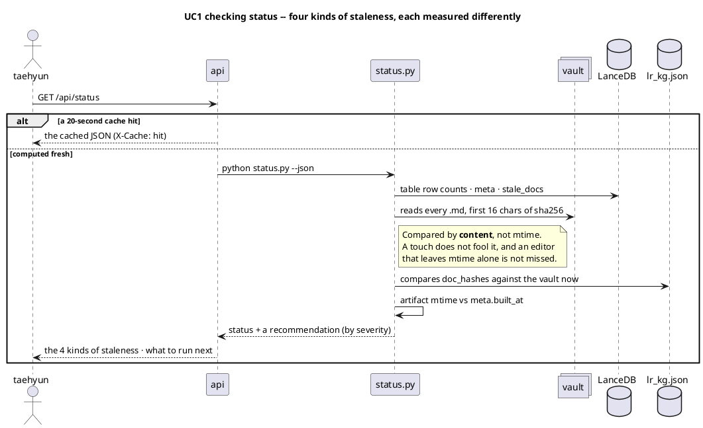

- Staleness is not one thing — vault↔index, extraction↔vault, KG display, and artifacts↔DB are measured separately.
- Each is fixed differently, so the UI shows all four separately too.

### UC2 — running a step and streaming the log

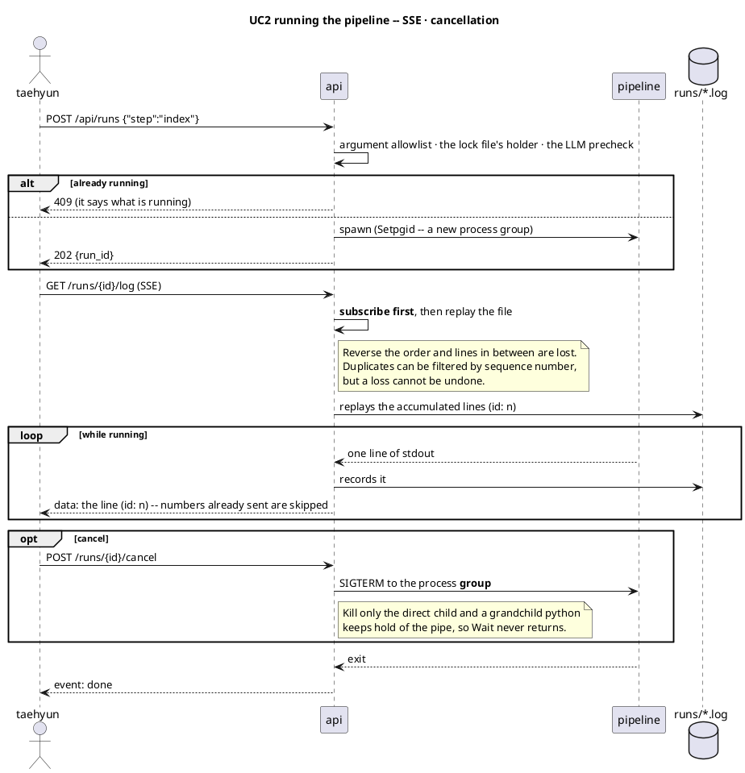

- Only one runs at a time — because the pipeline replaces the same LanceDB with `mode="overwrite"`.
- On reconnect, `Last-Event-ID` picks up where it left off.  Without it, tens of thousands of lines are pushed again.

### UC3 — confirming an entity alias

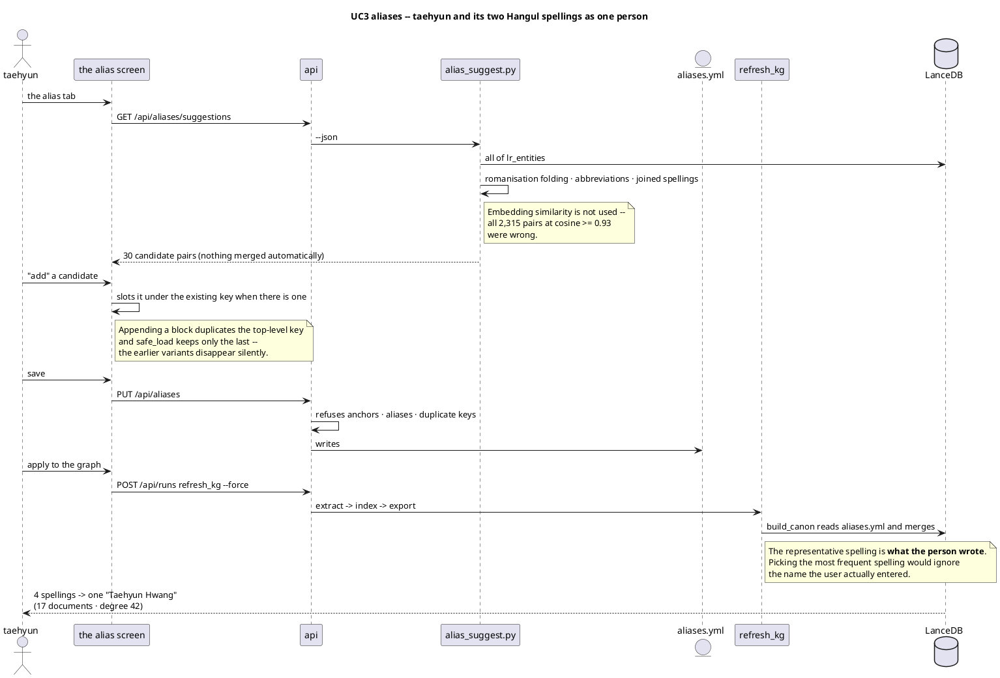

- Nothing is merged automatically.  Candidates are ranked and shown; a person confirms by writing the file.
- A wrong automatic merge quietly poisons the graph; a wrong candidate in a list is simply skipped.

### UC4 — search

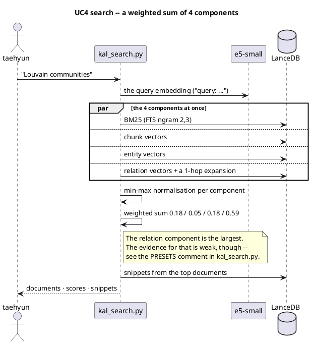

- The chunk-vector weight is the smallest at 0.05.  Measured one component at a time, chunks were the weakest.
- The basis for these weights sits inside this corpus's resolution limit — do not read them as settled.

### UC5 — incremental sync and the life of staleness

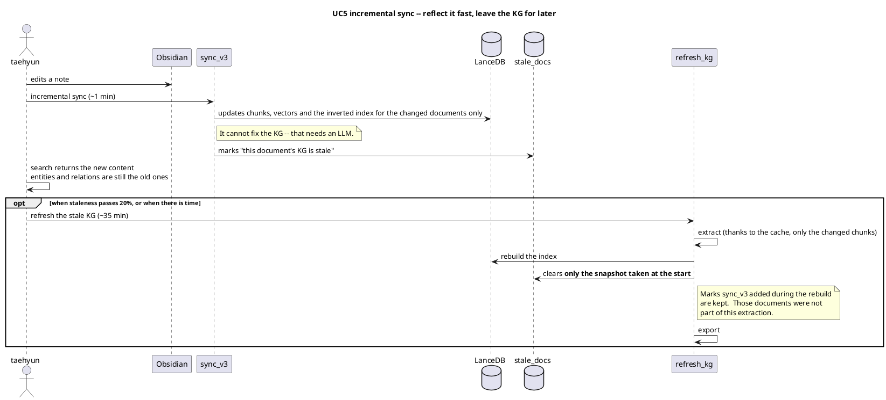

- Incremental sync **cannot fix the KG.**  Leaving a mark is the whole nature of this step.
- The 20% threshold is justified by cost, not by the size of the loss — a rebuild takes a few
  minutes on cache hits, so running it often costs little.  See the `refresh_kg.WARN_RATIO` comment.

---

## Appendix B — what to watch out for in this structure

| | Why |
|---|---|
| **One writer on the DB** | flock does not cross the container boundary (measured both ways).  Do not overlap a host `just index` with a web run |
| **The relay reads its flags at boot** | edit `claude_cli.py` and `just relay` has to be restarted |
| **There is no authentication** | loopback binding is the only defence.  Basic auth or forward-auth is required before attaching a domain |
| **An extraction failure can be silent** | a total failure exits 1.  A partial failure is retried as a cache miss on the next run |
| **Indexing reads what extraction produced** | there is an order.  `schema_v3` does not create entities; it moves `lr_kg.json` across |

Related documents — [`STACK.md`](./STACK.md) (containers and the relay in operation) ·
[`PIPELINE.md`](./PIPELINE.md) (step by step) · [`ERD.md`](./ERD.md) (table schemas) ·
[`ENTITY_RESOLVE.md`](./ENTITY_RESOLVE.md) (the merge rules)
