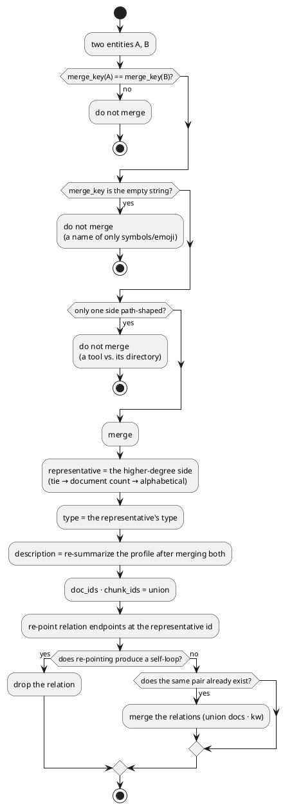

# Entity resolution rules

> **Status: applied (2026-08-17).** The implementation is [`entity_resolve.py`](../src/entity_resolve.py);
> the call sites are `lr_extract.group_nodes()` and `schema_v3.build_graph()`.
> Before: 8,121 entities · 12,369 relations → after: **7,958 · 12,228**. Verification in §11.

Decides **when two entities the LLM extracted from different documents are the same thing**, and
**when one name has to be split into several**.

```
merge   aliases.yml    different names → one node     §2–§10  (2026-08-17)
split   homonyms.yml   one name → several nodes       §12     (2026-08-20)
```

The two directions are symmetric — the machine proposes candidates and **a human confirms.**
Automatic judgement does not reach acceptable precision (§6), and a wrong split is as bad as a
wrong merge.

---

## 1. The previous rule and the problem it created

> This section describes the state **before 2026-08-17**. The current rule is §2.

The merge key was lowercase exact match, nothing more.

```python
k = n.lower()          # this was all of it
```

So a one-character difference in spelling produced separate entities.

```
   Hermes Agent(d68)  ·  hermes-agent(d26)      the same thing, counted separately
   AI 2027(d37)       ·  AI-2027(d20)
   환경변수(d19)        ·  환경 변수(d3)
```

Full scan: **165 groups / 340 entities** differed only in spelling.

### Where the key lives now

The merge key is the single [`entity_resolve.merge_key`](../src/entity_resolve.py), and three
places all go through **the same canon dictionary**. If the three diverge, relations point at
entities that do not exist.

| Location | What it does |
|---|---|
| [`lr_extract.py:495-498`](../src/lr_extract.py) | extraction — collecting per-chunk results into a whole document |
| [`schema_v3.py:1104-1113`](../src/schema_v3.py) | graph build — building the canon dictionary across all document entities |
| [`schema_v3.py:1164`](../src/schema_v3.py) | the relation pair key, `tuple(sorted([ks, kt]))` |
| [`schema_v3.py:1186`](../src/schema_v3.py) | endpoint resolution, `name2id.get(v["s"])` |

> ⚠ **Never change one side alone.** If the entity key and the relation endpoint key diverge,
> relations point at entities that do not exist. HIGH-1 in the 2026-08-17 review was exactly that
> family of bug — [`REVIEW-2026-08-17.md`](./REVIEW-2026-08-17.md) §HIGH-1.

---

## 2. The normalization that was applied

```python
def merge_key(s: str) -> str:
    s = unicodedata.normalize("NFKC", s).lower()
    return re.sub(r"[^0-9a-z가-힣]+", "", s)
```

| Step | Difference it absorbs | Example |
|---|---|---|
| `NFKC` | full-width/half-width, composed characters | `ＡＩ` → `AI` |
| `.lower()` | case | `Claude Code` → `claude code` |
| strip non-alphanumerics | spaces · hyphens · underscores · slashes · dots | `hermes-agent` → `hermesagent` |

Why `가-힣` is kept: Hangul stays **as-is** under this rule. No jamo decomposition, no
romanization — neither reaches acceptable precision (§6).

---

## 3. Two exclusion rules

Cases where the normalized forms match but the entities are **not** merged.

### Exclusion ① — names that normalize to an empty string

```python
if not merge_key(name):
    continue          # excluded from merge candidacy
```

Entities made only of symbols or emoji all collapse to `""` and become one lump.

```
   '✅/△/❌'(d1, pattern)   vs   '🔴/🟠'(d1, pattern)
   → both have merge_key = ""  → grouped together ✗
```

There are only 2 today, but **without the guard every symbol entity that arrives from now on
lumps together.** It is a hole in the rule, not a matter of count, so it is closed.

### Exclusion ② — only one side is path-shaped

```python
PATHY = re.compile(r"^[~./]|/$|^\.")
names = [e.name for e in group]
if any(PATHY.search(n) for n in names) and not all(PATHY.search(n) for n in names):
    continue          # a tool/concept vs. its directory — they name different things
```

```
   Hermes(d74)     |  ~/.hermes(d3)        the agent  vs  its config directory
   Terraform(d51)  |  terraform/(d1)       the tool   vs  a repo folder
   Obsidian(d116)  |  obsidian/(d5)        the app    vs  a folder
   Vault(d94)      |  vault/(d3)
   Wiki(d48)       |  wiki/(d4)
   pm2(d51)        |  ~/.pm2/(d1)
   notes(d12)      |  notes/(d4)
   raw/(d8)        |  raw(d1)
   … and 7 more groups (all d≤2)
```

**Why exclude** — `~/.hermes` is a filesystem location and `Hermes` is the software. Merging them
destroys the information "where the config lives". Everything that would be absorbed has `d≤5`,
so almost nothing is lost by not merging (total degree 30).

**If both sides are path-shaped, they merge** — that is what the `all(...)` condition means.
The current DB's 15 groups are **all mixed**, so this branch has not fired yet.

Note — `raw` is **not** path-shaped: no leading `~/` or `./`, no trailing `/`. So `raw/`(d8) and
`raw`(d1) are a mixed group and get **excluded**. They very likely name the same folder, but the
rule cannot know that, and at d1 the conservative choice is cheap.

---

## 4. When the types differ

Of the 149 merge candidate groups, **70 have mismatched types.** But that is not a signal not to
merge — it is a **symptom of already being split.**

```
   Hybrid Retrieval(concept)   ~  hybrid-retrieval(method)
   Evergreen notes(concept)    ~  evergreen-notes(pattern)
   Shift-Left Testing(concept) ~  shift-left-testing(method)
```

These are traces of the LLM classifying the same thing differently per document. They are not
different because their types differ; their types differ because they are split.

**Rule — take the type of the representative (the higher-degree side).** The side that appears
more often was named with more context in view, so it is more trustworthy. On a degree tie, the
side with more documents; on a further tie, the alphabetically first name (reproducibility).

### The representative and the "display name" are different

They are decided separately. Measurement produced cases where they diverge.

| | Decided by | Decides |
|---|---|---|
| **representative** | relation count → document count → alphabetical | `name_norm` (the merge key) · `type` |
| **display name** | the **most frequently used spelling in the source** → alphabetical | the name shown on cards and in the graph |

```
   AX팀(23 relations) + AX 팀(6 relations)
     representative → 'ax팀'        (more relations)
     display name   → 'AX 팀'        (the spelling used more often in the source)
     result         → name='AX 팀'  name_norm='ax팀'  d29
```

It looks inconsistent, but it is intended. The name the user sees should be **the spelling they
actually use**, and the merge key should follow **the better-connected side** to stay stable.
`name_norm` is an internal key, so differing from the display name is not a problem — no code
assumes it equals `name.lower()` (verified exhaustively).

---

## 5. Decision flow



---

## 6. Counter-evidence — do not merge on embedding similarity

"If the vectors are close, surely they are the same thing" is **false on this data.**

```
   pairs with cosine ≥ 0.93        2,315   ← in the current graph (7,620 entities)
   of those, also equal after name normalization        0
   → every one of them is a different entity
```

**Do not read that "0" literally.** Entities with the same name were **already merged** by
`build_canon` during indexing, so no same-name pair can remain in the post-merge graph. The
`58 (2.1%)` the previous version recorded was measured on the 7,710 entities **before** merging.

So the table should be read this way — **after merging everything that could be merged by name,
2,315 pairs still exceed cosine 0.93, and every one of them is a different thing.** Automatic
similarity merging would have wrongly merged all 2,315.

What actually turned up:

```
   0.989  cs.airs.ai        ~  hr.airs.ai        different subdomains
   0.986  Sean Jaejun Lee   ~  Jungsik Kim       different people
   0.984  30x speedup       ~  50x speedup       different numbers
   0.982  /l/ 음성           ~  /r/ 음성           opposite concepts
   0.980  카드               ~  은행
```

**The cause** — entity vectors embed the *profile summary*, and those summaries come from the
same documents and the same context. So when the context matches, the vectors sit close even
when the referents differ. A vector measures "these two are in the same story", not "these two
are the same thing".

**Therefore similarity is not used for merge decisions.** It is useful as an exploratory
"contextually nearby entities" feature — that is a different feature and needs a different label.

---

## 7. Results after applying (measured)

Merging happens in **two stages**. It is not the same rule applied twice: `lr_extract` merges
first to produce the input for profile summarization, and `schema_v3` merges whatever is left
after passing through `norm_name()` (which strips parenthetical annotations and so on).

> ⚠ **The two blocks below count different things.** Concatenating them does not add up.
> The pipeline figures (A) count *extraction output*, while the user-visible change (B) counts
> *what is loaded into the DB*. The 8,263 extraction output is raw, without even the old
> lowercase merge; the DB's 8,121 is the number after the old rule already merged once. Different
> starting points are normal.

**A. Each pipeline stage** — input is the raw per-chunk LLM extraction

```
   lr_extract.group_nodes()      159 groups   entities 8,263 → 8,095 · relations 12,861 → 12,720
                                     55 profile re-summaries (208 cache hits)
   schema_v3.build_graph() 135 groups   entities 8,095 → 7,958 · relations 12,720 → 12,228
```

The two stages are not the same rule running twice — `schema_v3` puts `norm_name()`
(parenthetical stripping and the like) in between, so pairs that first become equal there
remain. Adding 159 + 135 is therefore meaningless.

**B. The change the user experiences** — the DB before vs. the DB after

```
   entities 8,121 → 7,958 (-163)
   relations 12,369 → 12,228 (-141)
   max degree 116 → 111
   disk 1,261MB → 1,206MB
```

(Re-measured 2026-08-18: DB entities 7,958 · relations 12,228 — matches B's "after")

Degree changes:

```
   Hermes Agent      d68 → d80     + hermes-agent
   AI 2027           d37 → d48     + AI-2027
   LLM wiki pattern  d39 → d46     + LLM-wiki-pattern
   Hybrid Retrieval  d29 → d40     + hybrid-retrieval
   Evergreen notes   d35 → d39     + evergreen-notes
   AX 팀              d23 → d29     + AX팀
   Claude Code       d74 → d77     + claude-code
   Agent Loop        d50 → d50     + agent-loop   ← no increase
   Obsidian          d116 → d111                  ← decrease
```

> ⚠ **Degree is not a simple sum.** If both spellings had a relation to *the same counterpart*,
> those collapse into one after merging. `Agent Loop` stays at d50 because all 9 of
> `agent-loop`'s relations were duplicates, and `Obsidian` **decreased** because 5 of its own
> relations folded as duplicates. This is correct — duplicates disappeared, not information.

The full list of merged groups is `docs/entity_resolve_groups.txt` (not published — it contains
real-name entities, `.gitignore`).
(A snapshot from **before** applying — in the post-apply DB these groups are already one.)

---

## 8. Where to restart from

Merging is a **graph-build** concern, so it does not touch the LLM extraction cache.

```
   Steps 1–4  session collection · distillation · indexing · chunking   unchanged
   Step 5     LLM extraction (~/.kal/lr_cache.jsonl)                    unchanged  ← the 3-hour one
   Step 6     profile summarization                                     re-run (merge results change)
   Step 7     build_graph — merging and relation re-pointing            re-run
              entity/relation vector regeneration                      re-run
   after      export_kal_graph.py · export_webgl.py                     re-run
              verify_docs.py                                           re-run (figures change)
```

For the re-run scope and cost see [`PIPELINE.md`](./PIPELINE.md) §rollback and re-run.
**No re-extraction is needed** — the cache is keyed on chunk hashes and the prompt has not
changed, so everything hits.

---

## 9. Rolling back

Revert the normalization function to `.lower()` and re-run steps 6–7. The extraction cache is
still there, so nothing is lost.

---

## 10. What this rule does not solve

### The same referent under different writing systems

```
   taehyun(d43)  ·  태현(d8)          almost certainly the same person
   Jinwoo(d2)    ·  진우(d3)          cannot be decided
```

Normalizing gives `taehyun` → `taehyun` and `태현` → `태현`, which still differ. Hangul↔Latin
candidates number **287 pairs** at cosine ≥0.93, but as §6 shows most of those are distinct
things. Automatic judgement does not reach acceptable precision.

`Jinwoo` / `진우` have descriptions from different contexts (a participant in an evaluation
session vs. a speaker in the corpus), so even a human cannot settle it. **It is the kind of
problem that requires reading the documents.**

**The recommended solution — an alias file the user writes themselves.** Twenty or thirty lines
cover every case that actually arises, and it is more accurate than automatic inference.

```yaml
# aliases.yml (not implemented)
taehyun: [태현, Taehyun, 황태현]
Jinwoo:  [진우]          # ← the user adds this only when they are the same person
```

### Abbreviations and expansions

```
   PKM  ·  Personal knowledge management
   KG   ·  Knowledge Graph
```

Normalization cannot catch these. They belong in the alias file.

---

## 11. Post-application verification — measured

### Integrity (run 2026-08-17, entities 7,958 · relations 12,228)

```
   ✅ unresolved endpoints (-1)      0
   ✅ endpoints with no entity        0
   ✅ id ↔ name mismatches            0
   ✅ degree mismatches               0
   ✅ self-loops                      0
   ✅ duplicate pairs                 0
   ✅ duplicate name_norm             0
   ✅ groups the rules say to merge but that are still split   0
```

The last item is the check on the rule itself — a group that does not hit an exclusion rule and
is still split means merging is leaking.

### Search quality

At the time of measurement, `default` used **chunk 0.20** (later changed to 0.05 — see
`kal_search.py`). Those figures are kept as they were so that before and after can be compared
under the same conditions.

```
                      before    after     diff
   control default    0.775    0.776    +0.001
   overall default    0.792    0.787    -0.005
   control legacy     0.658    0.659    +0.001
   overall legacy     0.706    0.707    +0.001

   honest protocol (A/B, 20 splits)
   test-set Δ median   +0.116   +0.117
   significant of 20     19       19
   surviving BH of 146   139      139
   held-out Δ          +0.108   +0.124
```

**Verdict — no detectable change.** One of the four conditions (overall default) is 0.005 lower,
but at n=58 that is not distinguishable (HYBRID_METHODOLOGY §7 L4: differences around ±0.02
cannot be settled). The protocol Δ and held-out went up if anything. Read literally, §11's
original criterion ("must not go down") is unmet in one condition, so **no improvement is
claimed and this is recorded as "no change".**

The value of merging is not the search score but **the accuracy of the graph** — if `Hermes
Agent` is split into two nodes, whichever one you look at shows only half its relations. That is
the kind of error nDCG does not catch.

### Acceptance table

| Item | Passing criterion |
|---|---|
| endpoint integrity | 0 relations with `src_id`/`tgt_id` of `-1` |
| id ↔ name consistency | 0 cases of `src_name != ent_rows[src_id].name` |
| degree consistency | 0 cases of `entity.degree` ≠ the actual relation count |
| self-loops | 0 cases of `src_id == tgt_id` |
| duplicate pairs | 0 cases of the same `(src,tgt)` pair appearing twice or more |
| search quality | nDCG@10 from `tune_alpha.py --protocol --seeds 20` must not fall below the pre-merge value |
| documented figures | re-check after `verify_docs.py --fix` |

Why checking search quality is mandatory: when degree changes, the candidate ordering of
`entity_vec`/`relation_vec` changes and the `--min-degree` filter boundary moves. Whether merging
**made search worse** has to be established by measurement, not assumption.

---

## Evidence

- Merge sites — [`lr_extract.py:131`](../src/lr_extract.py) · [`schema_v3.py:305`](../src/schema_v3.py) · [`schema_v3.py:331`](../src/schema_v3.py) · [`schema_v3.py:345`](../src/schema_v3.py)
- The family of bugs a key mismatch creates — [`REVIEW-2026-08-17.md`](./REVIEW-2026-08-17.md) §HIGH-1 (ids and names disagreeing on 46% of relations)
- Full measurement — 2026-08-17, against 8,121 entities · 12,369 relations. To reproduce: group by §2's `merge_key`, then apply §3's exclusion rules
- The `NFKC` normalization form — [Unicode Standard Annex #15](https://www.unicode.org/reports/tr15/) — last updated 2025-08, retrieved 2026-08-17
- The entity type enum — `ENTITY_TYPES` in [`lr_extract.py`](../src/lr_extract.py) (10 kinds + the `other` fallback. The list and its reasoning are in [PIPELINE.md](./PIPELINE.md) §extraction)

---

## 12. Splitting — homonyms (2026-08-20)

### The problem

`vault` means at least three things in this repository:

```
Obsidian note store          20 documents
1Password card storage        3 documents
a protected data directory    6 documents
```

The shared name made them **one node**. That node has degree 76 and mixes unrelated neighbours,
so asking about 1Password drags Obsidian's neighbours along.

### It was already being detected

Rule 4 of the summarization prompt instructs: *"if the fragments plainly describe different
things that merely share a name, say so and describe each separately."* And it works — measured,
the `description` of **17** entities says so itself:

```
"Vault" refers to two distinct systems. The primary vault is an Obsidian-based…
```

**But that judgement stayed in prose.** `description` is one string column, so using it
mechanically means hunting with regexes, and which sense there are and what the cues were exist
nowhere. The LLM noticed, and that knowledge never reached the data structure.

### Rule format

```yaml
# homonyms.yml
vault:
  - name: 1Password vault
    when: ["1password", "카드", "멤버", "결제"]
  - name: Obsidian vault
    when: ["obsidian", "second brain", "wiki", "노트", "마크다운"]
```

- Cues are lowercase substring matches against **the fragment description + the source document path**
- The first match from the top wins → put the narrower cues higher
- An entry with an empty `when` catches everything else (the default)
- **If nothing matches at all, it stays under the original name** — nothing is force-assigned

The reason paths are consulted too is that in practice they often give the answer:
`raw/conversations/sessions/1password-법인카드-…`

### Where the split happens

Inside [`lr_extract.group_nodes()`](../src/lr_extract.py), on the line where `ents[k] = {...}`
executes.

```python
d = (e.get("description") or "").strip()
n = split_sense(n, d, r["doc"])        # ← the name changes
k = canon.get(n.lower(), n.lower())    # ← the key changes
if k not in ents:
    ents[k] = {...}                    # ★ a new node
```

**Only at this moment** are all three in hand at once: the original name, **this fragment's
description**, and **this fragment's source**. One line later the fragments have merged into one
lump and which fragment carried which sense cannot be recovered. It is impossible at
summarization (4c) or indexing (Step 5).

**Relation endpoints are split at the same time.** Splitting only entities leaves relations
pointing at a name that no longer exists — a ghost reference, the kind indexing discards 217 of
every time.

### Why not just ask the LLM

Three reasons:

1. **Calls explode.** There are more than 21,000 fragments, and asking one at a time creates
   another 4,913-second extraction. A rule comparison is one line of `c in hay` and costs
   nothing.
2. **It does not reproduce.** Re-extracting the same input fails to produce 39% of the entities.
   If `vault` fragments get assigned differently on every run, the graph shakes.
3. **A wrong split is as bad as a wrong merge** — the same principle §6 established for merging.
   Whether `role` means "a role" or "an IAM role" requires a human to read the documents.

### Measured results

```
before:  vault  one node · 23 documents · degree 76
after:   Obsidian vault    32 fragments · 20 documents
         1Password vault    4 fragments ·  3 documents
         vault              8 fragments ·  6 documents   ← no cue matched. Original name kept
```

### Still manual

The single `vault` rule was written by hand after a human hunted 17 cases with a regex. What
remains to automate:

- **`homonym_suggest.py`** — find polysemy sentences in `description` and produce a candidate
  list (symmetric with `alias_suggest.py`)
- **Add `senses` to the summarization output** — if the LLM emits the cue words in a structured
  form, a human **only has to confirm** instead of writing the rule from scratch
- **A settings-page panel** — next to `AliasPanel.tsx`
