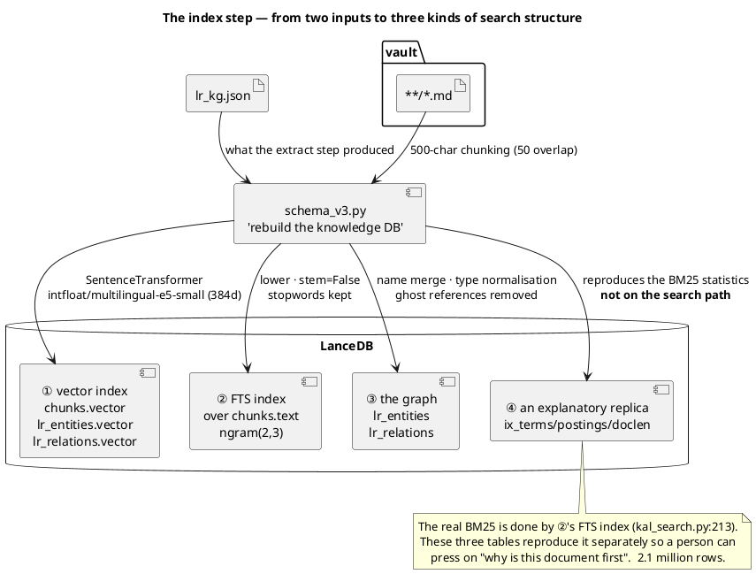
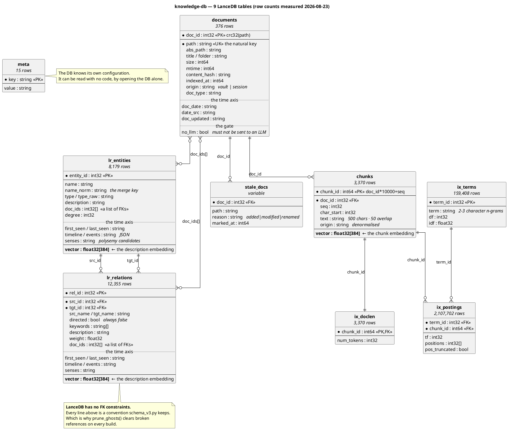

# ERD — the knowledge-db schema

9 LanceDB tables.  Verified against real `list_indices()` output.
The schema definition is `schemas()` in [`../src/schema_v3.py`](../src/schema_v3.py).

---

## What the index step builds

One run of `schema_v3.py` builds **three kinds of index** at once.  "Index" is not one thing
here, which the name alone does not convey.



- **Read this first** — the four arrows are the four meanings of "index".  It is not one thing.
- The embeddings (①) and the graph (③) have **different inputs.**  ① comes from the vault body, ③ from `lr_kg.json`.
- ④ changes no search result whether present or not.  It only costs disk (the price paid for explainability).

---

## The whole relationship diagram



- **Read this first** — only `documents ─1:N─ chunks` is a solid FK.  The two KG tables point at documents through a `doc_ids` **list**, an M:N with a different cardinality.
- **Vectors sit in three places** (`chunks`, `lr_entities`, `lr_relations`).  Three of the search's four weighted components correspond to them (the fourth is BM25).
- `ix_postings`'s 2,107,702 rows derive from `chunks`'s 3,370.  They are statistics, not the original.
- Only `stale_docs` has a different lifetime —— `sync_v3` marks and `schema_v3` clears.

---

## Where a chunk embedding goes

```
1 document (3,000 chars)
   └─ cut into 500 chars, overlapping by 50     →  7 chunks
        └─ intfloat/multilingual-e5-small       →  384-dimensional float32
             └─ 7 rows in the chunks table
                  each row: chunk_id · doc_id · seq · char_start
                        · text (the source fragment) · origin · vector[384]
```

**The source text and the vector are in the same row.**  Found by vector search, the body can
be pulled out with no second lookup.  `char_start` is there to trace a fragment back to where
it came from in the source, and `origin` is denormalised out of `documents` so that an
`--origin` filter does not have to list hundreds of `doc_id`s in an IN clause.

Measured (2026-08-23): 376 documents → 3,370 chunks → **3,370 384-dimensional vectors**.

---

## Table by table

### `meta` — the DB describes itself

| Column | Type | |
|---|---|---|
| `key` | string | PK |
| `value` | string | everything is stored as a string |

15 rows.  Kept so the DB can be read without the code, by opening it alone.

```
   embedding_model          intfloat/multilingual-e5-small
   embedding_dim            384
   chunk_chars / overlap    500 / 50
   fts_tokenizer            ngram(2,3)
   bm25_k1 / bm25_b         1.2 / 0.75
   doc_id_scheme            crc32(path) & 0x7FFFFFFF
   chunk_id_scheme          doc_id*10000 + seq
   relations_directed       false (canonical sorted src/tgt)
   entity_types_canonical   actor|artifact|concept|decision|event|failure|method|metric|project|tool|other
   vault_path · schema_version · built_at · n_documents
```

---

## The permanent assets outside this ERD

Draw the LanceDB tables alone and **the pipeline's two most expensive assets are invisible.**

| File | What | If lost |
|---|---|---|
| `~/.kal/lr_cache.jsonl` | the per-chunk LLM extraction results (append-only) · **the only source of the edit history** | **4,913 seconds** to re-extract + the history gone for good |
| `~/.kal/lr_kg.json` | the merged graph — where `timeline` is built | as above |
| `~/.kal/lr_summary_cache.jsonl` | the profile-summary cache (1,307 lines accumulated) | 305 calls on one run |
| `~/.kal/sessions/` · `distilled/` | the session distillation intermediates | steps 1–2 rerun |

The DB (`~/.kal/db`) is **regenerated from those three in 64 seconds**.  Not the other way ——
**the backup priority is these files, not the DB.**

> `lr_cache.jsonl` is append-only, so older versions of the same `(doc, idx)` accumulate.
> Measured: 907 unique of 1,720 lines, 813 superseded.  **Only the latest may be read** ——
> otherwise the fragment count inflates 1.8×, and counting it that way really did make the
> design document's numbers wrong once.

---

### `documents` — one row per document

| Column | Type | Index | Meaning |
|---|---|---|---|
| `doc_id` | int32 | BTREE | **PK.** `crc32(path) & 0x7FFFFFFF` |
| `path` | string | BTREE | **The natural key.** vault-relative |
| `abs_path` | string | | the absolute path, openable as-is |
| `title` | string | | frontmatter `title`, or the filename |
| `folder` | string | BITMAP | the parent folder |
| `origin` | string | BITMAP | `vault` \| `session` |
| `doc_type` | string | BITMAP | the brain-ingest classification.  `""` for vault notes |
| `size` `mtime` | int64 | | |
| `content_hash` | string | | the first 16 chars of sha256.  **The heart of rename detection** |
| `indexed_at` | int64 | | |
| `doc_date` | string | | **The basis of the time axis.** `"2026-06-25"`, or `""` |
| `date_src` | string | | **which key** that date came from |
| `doc_updated` | string | | frontmatter `updated`.  **A different axis** from `doc_date` |
| `no_llm` | bool | | a document that must not go off the machine |

**Why `doc_id` is a hash rather than a sequence.**  With a sequence, adding one file shifts
every later document's id and breaks every `doc_ids` reference.  A path hash keeps **existing
ids stable when other files appear.**  The price is the chance of a collision, so `scan_vault()`
fails immediately on one (rather than overwriting silently).

**`content_hash` decides a rename.**  The same hash on both the deleted and the added side is a
rename, and then only the path is swapped, with no re-embedding.

**Why `doc_date` exists when there is `mtime`.**  `mtime` is when the file was touched, not the
time of its content.  Measured, it differs from the frontmatter date in **355/374 (94.9%)** and
by up to 132 days (17 are tied at 132 — `wiki/overview.md` is one).  Build the time axis on
`mtime` and four months of it is wrong at once.

**Why `date_src` is kept.**  The four date keys mean different things, and `updated` in
particular is "the day a person edited it", not the time of the content.  It still has to be
used when nothing else exists —— otherwise the document drops out of the time axis entirely.
**Use it, but record that it was used.**  That is what makes "can this date be trusted?"
answerable later.  Once mixed, the two cannot be separated.

| `date_src` | Meaning | Measured | Trust |
|---|---|---|---|
| `generated_at` | the time a machine made it (`distill_sessions`) | 290 | ✅ |
| `captured` | the day the conversation was captured | 0 | ✅ |
| `created` | the day a person created the document | 82 | ⭕ |
| `updated` | the day a person **edited** it —— the last resort | 2 | ⚠ |
| `none` | no date → dropped from the time axis | 2 | — |

**`doc_updated` is not a fallback for `doc_date`.**  They answer different questions ——
`doc_date` is "when is this content from" (valid time), `doc_updated` is "when was it last
touched".  Overwriting one with the other as a fallback mixes them.  Measured, of the 77 with
`updated`, **75 match `doc_date` and only 2 differ** —— the signal is thin today, but as the
vault ages that gap becomes the "needs review" list.

**Why `no_llm` is frozen into the index.**  It decides **"send this off the machine?"**, not
"index this locally?" (`SKIP`) —— the two judgements are not the same
([`lr_extract.py:289-297`](../src/lr_extract.py)).  MCP is **the second transmission boundary**,
where indexed content is opened to an LLM, so it has to read this value on every query; and
since the frontmatter cannot be re-parsed each time, it is frozen at index time.  **The price**:
attach `no_llm` to a document and the DB value stays old until a re-index.  Which is why
`kal_doc` checks the marker once more when it reads the source text.

**Why `origin` is a column.**  Session documents were first put in through a separate pipeline,
and the result was an accident: `diff_vault()` judged 464 sessions "not in the vault" and
marked them for deletion.  Session documents are now real files inside the vault
(`raw/conversations/sessions/`), and origin is decided by path in a single pipeline.

---

### `chunks` — what search actually walks

| Column | Type | Index | Meaning |
|---|---|---|---|
| `chunk_id` | int64 | BTREE | **PK.** `doc_id * 10000 + seq` |
| `doc_id` | int32 | BTREE | **FK → documents** |
| `seq` | int32 | | the sequence within the document |
| `char_start` | int32 | | the start position in the source |
| `text` | string | **FTS** ngram(2,3) | 500 chars · 50 overlap |
| `origin` | string | BITMAP | **denormalised** from documents |
| `vector` | float[384] | | the `passage: {text}` embedding |

**Why `chunk_id` is a composite key.**  Knowing `doc_id` alone gives that document's chunk range
(`doc_id*10000` .. `+9999`), and conversely `chunk_id // 10000` is the `doc_id`.  Both ways
without a join.  The price is **a ceiling of 10,000 chunks per document** — a 5MB document at 500 chars.

**Why `origin` is stored twice.**  An `--origin session` filter has to narrow `chunks`, and with
that column only in `documents` it would mean listing hundreds of doc_ids in an `IN` clause.
Denormalised with a BITMAP index, one index lookup finishes it.  The cost is 3,370 rows × one string.

---

### How a node is decided —— joining and splitting

There are two directions in which a row of `lr_entities` comes to exist.  Both live in
[`src/entity_resolve.py`](../src/entity_resolve.py), and **both read a rule file a person confirmed**.

```
aliases.yml     several names → one node      Taehyun Hwang ← taehyun · its two Hangul spellings
homonyms.yml    one name → several nodes      vault → Obsidian vault · 1Password vault
```

**Why splitting is needed.**  `vault` is at least three things in this repository —— the
Obsidian note store, the 1Password card vault, and the protected data directory.  The shared
name fuses them into one node, and then **a degree-76 node mixes entirely unrelated neighbours.**
Ask search about 1Password and Obsidian's neighbours come along.

The summarising LLM already notices —— measured, **17** entities' `description` says
"refers to two distinct systems" of its own accord.  But that judgement stayed **in prose**
and never reached the graph structure.

**Where the split happens.**  Inside [`lr_extract.group_nodes()`](../src/lr_extract.py), on the
line that runs `ents[k] = {...}`.  It is possible only there, because that is **the only moment
a fragment's description and source document are still both in hand** —— one line later the
fragments are fused and which fragment meant which sense cannot be recovered.

```yaml
# homonyms.yml
vault:
  - name: 1Password vault
    when: ["1password", "카드", "멤버", "결제"]     # if a fragment or path holds one of these
  - name: Obsidian vault
    when: ["obsidian", "second brain", "wiki", "노트"]
```

The cues are matched case-insensitively as substrings against **the fragment description plus
the source document path**.  The first match from the top wins, and **anything matching nothing
stays under the original name** —— nothing is force-assigned.  A wrong split is as bad as a wrong join.

A relation's two endpoints are split along with it.  Split the entities alone and relations
point at a name that no longer exists, becoming **ghost references** (the 217 the index discards every time).

**Nothing is judged automatically.**  A machine proposes candidates (`alias_suggest.py`) and a
person confirms them in `aliases.yml` / `homonyms.yml`.  There are 2,315 pairs at cosine ≥0.93
and all of them are distinct, so the precision is not there (§6).

---

### `lr_entities` — the entities the LLM extracted

| Column | Type | Index | Meaning |
|---|---|---|---|
| `entity_id` | int32 | | **PK** |
| `name` | string | | the original, for display |
| `name_norm` | string | BTREE | **The merge key.** whitespace folded · parenthetical notes removed · lowercased |
| `type` | string | BITMAP | normalised to 8 kinds |
| `type_raw` | string | | the type the LLM actually emitted (28 kinds) — kept |
| `description` | string | **FTS** | the profile.  Rewritten by the LLM at 8 or more fragments |
| `doc_ids` | list\<int32\> | **LABEL_LIST** | **N:M → documents** |
| `degree` | int32 | — | the number of attached relations.  **No index** — a `--min-degree` filter is a full scan |
| `vector` | float[384] | | `passage: {name}: {description}` |
| `first_seen` | string | | the `doc_date` of the earliest source document |
| `last_seen` | string | | the `doc_date` of the latest source document |
| `timeline` | string | | JSON `[{at, change}]` — **only what actually changed** |
| `events` | string | | JSON `[{at, doc_id, rev, at_exact, text}]` — **the raw fragments** |

> ⚠ `chunk_ids` was **deleted from both tables on 2026-08-19**
> ([`schema_v3.py:6`](../src/schema_v3.py)).  Six leftovers in this document were cleared on
> 2026-08-20 —— when the tables, the diagrams and the prose disagree, the ERD cannot be trusted.

**The time axis has three layers.**

```
first_seen / last_seen   **deterministic**, from the dates.  Never touches the LLM
events                   the raw fragments, **verbatim**.  Not flattened.   present on 99.3%
timeline                 what the LLM picked as "changed".                  present on 0.85%
```

The reasons for separating them differ:

- Keeping `first_seen`/`last_seen` outside the LLM —— **an `as_of` lower bound has to survive a
  failed summary.**  Put both through the LLM and one failed call erases the whole time axis.
- Keeping `events` —— a summary folds 37 fragments into 900 characters and **throws detail away.**
  With the source text there, the consuming LLM can distrust our summariser's verdict and read
  for itself.  Measured, 24,106 events at **5.9MB**, **4.8×** the summary (1.2MB).  Not free ——
  and the reason to keep it anyway is not its value but **its irreversibility**: once a summary
  is folded the fragments cannot be recovered, and re-summarising with a fixed prompt needs them.
- `timeline` is **the interpretation** on top.  Convenient, but present on 0.85% and with unmeasured reproducibility.

### `events` —— "what did it say, and when"

```jsonc
{"at": "2026-07-11", "doc_id": 123, "rev": "current",
 "at_exact": true, "text": "AWS 외에 DigitalOcean 등 VPS 도 SSH 키로 지원"}
```

| Field | Meaning |
|---|---|
| `rev` | `current` = that document's **present** content · `superseded` = its earlier content |
| `at_exact` | `false` means the date is **an estimate** (see below) |

**Editing a document adds one more event.**  Because `lr_cache.jsonl` is append-only, the older
line for the same `(doc, idx)` stays —— measured, **813** were preserved that way, and they used
to be discarded as "duplicates".  As a result **49% of entities (3,756/7,710)** carry an event
from an earlier version.

```
① document 1 written   a cache line is added (h="aaa")   → events[0]  rev=current
② document 2 added     a cache line is added (h="bbb")   → events[1]  rev=current
③ document 1 edited    h changes to "ccc", so it is re-extracted
                       a cache line is **added** (① remains)
                         → events[0] is demoted to rev=superseded
                         → events[2] becomes the new rev=current
```

`description` summarises **the current version only**.  Include the old and content already
known to be wrong mixes into "what is it now".  History is kept by `events` and the narration
speaks of the present —— that separation is the point of this design.

> ⚠ **Records before 2026-08-20 have estimated dates** (`at_exact: false`).
> The extraction time (`at`) was added to the cache record that day.  Earlier lines have no
> time, so they fall back to the document's creation date, which makes them **the same date as
> the current version**.  Deriving it from `doc_updated` was tried and abandoned: of the 813,
> only **5** could be separated (only 2 of 353 documents have `updated ≠ created`).
> **What changed is knowable; when is not.**

`timeline` **being empty is the default** —— measured, only **65 of 7,620 (0.85%)** have a value.
That low rate is the success metric: the point is to pick out "only what changed", so a high
one would mean description scatter had been mistaken for change.

```
Claude Code  6   05-14 raised to the main runtime → 06-23 qmd memory → 07-19 folded into Orca
Obsidian     0   ← only the wording differed; nothing actually changed
```

> **Two cautions for the reader**
> 1. An empty `timeline` must not be read as "it did not change".  Change extraction ran only
>    on entities with 8 or more description fragments (259/7,710).  **It is indistinguishable
>    from "it was never a target"** —— a limit of the current schema.
> 2. `last_seen` is "last **mentioned**", not "it disappeared then".  This model is
>    uni-temporal and does not express invalidation (`invalid_at`).

The design basis: [`docs/TEMPORAL_DESIGN.md`](./TEMPORAL_DESIGN.md)

**Type normalisation.**  When the LLM invents something outside the 10 kinds the prompt declares
(see `docs/PIPELINE.md` §extract), `TYPE_MAP` folds it, and what still does not fit becomes
`other`.  **The original is kept in `type_raw`** — so a wrong folding rule can be undone.

`TYPE_MAP` **also accepts the old scheme** (`pattern`→`method`, `person` and `organization`
→`actor`).  Data from before a re-extraction does not break, and once the re-extraction is done
those entries naturally fall out of use.

⚠ This list **has to match in three places** —— `lr_extract.ENTITY_TYPES` (the prompt),
`schema_v3.CANON_TYPES` (normalisation) and `export_kal_graph.TYPE_COLOR` (the viewer's colours).
Miss one and that type quietly becomes `other`, or comes out grey.

**Array columns and LABEL_LIST.**  Entity↔document is N:M.  Normally that means a join table,
but LanceDB's `LabelList` index supports searching array elements, so it is used **without one**.
Rows whose `doc_ids` contains a given value can be found through the index.

**(removed) `chunk_ids` was a reconstruction after the fact.**  The LLM emits entities from a
chunk, but after merging, which chunk they came from is lost.  So chunks whose body mentions
the name were found again and filled in — **only 68% of entities and 92% of relations get
filled.**  It can differ from the original attribution.

---

### `lr_relations` — relations between entities

| Column | Type | Index | Meaning |
|---|---|---|---|
| `rel_id` | int32 | | **PK** |
| `src_id` | int32 | BTREE | **FK → lr_entities** |
| `tgt_id` | int32 | BTREE | **FK → lr_entities** |
| `src_name` `tgt_name` | string | | denormalised (for display — a label without a join) |
| `directed` | bool | | **always `false`** |
| `keywords` | list\<string\> | LABEL_LIST | the relation keywords the LLM extracted |
| `description` | string | **FTS** | **the most important field** (below) |
| `weight` | float | | always 1.0 today (unused) |
| `doc_ids` | list\<int32\> | LABEL_LIST | N:M → documents |
| `first_seen` | string | | the `doc_date` of the earliest source document |
| `last_seen` | string | | the `doc_date` of the latest source document |
| `timeline` | string | | JSON — **the relation's state transitions.**  Measured 11/12,246 |
| `events` | string | | JSON — the raw fragments |
| `vector` | float[384] | | `passage: {src} - {tgt}: {description}` |

**Why relations carry a time axis too —— some things the entity cannot say.**

```
Obsidian — graphify      planned future feature  →  implemented as a plugin
Phase 2 — seCall         planned validation      →  active pilot deployment
                         multi-axis gate: required → on hold
qmd — Obsidian           vault integration       →  done · verified by the full test suite
Evergreen Notes — LLM Wiki   partial structure applied   →  automated, LLM-based full integration
```

The `graphify` **entity** can say "it was implemented".  But **"the relation with Obsidian moved
from planned to implemented"** attaches only to the relation.  `planned→implemented`,
`required→on hold`, `partial→full` —— these are the relation's **state transitions**.

The cost is already paid.  The values come out of the same LLM call, so not making the column
means **computing and throwing away**.

> ⚠ **A limit —— the dates cluster.**  Of the 11, **9 have a change date of `2026-08-16`**.
> Most likely one document described those relations in detail and that was read as "it changed
> that day".  So **the point-in-time confidence is lower than the entity timeline's.**  Check
> the source text in `docs[]` before asserting anything on a relation's date.

**Undirected.**  The merge key is `tuple(sorted([src, tgt]))`, so `A→B` and `B→A` fold into one
row.  There is therefore no in/out degree.  The `directed` column exists to state that fact
**inside the DB** — if direction is introduced later, this flag is what separates the two.

**`description` is the heart of search.**  This field's embedding is `relation_vec`, and in the
measured weights it **takes 0.50** (the largest of the four components).  Queries of the form
"how does A act on B" land here.

---

### `ix_*` — the BM25 inverted index (not used for search)

```
   ix_terms       term_id PK · term [BTREE] · df · idf
   ix_postings    term_id [BTREE] · chunk_id [BTREE] · tf · positions · pos_truncated
   ix_doclen      chunk_id [BTREE] · num_tokens
```

**Why two inverted indexes exist.**  The real BM25 search is done by the **FTS index** on
`chunks.text` (Lance's internal FST + delta/varint postings).  These three tables reproduce that
computation separately **so a person can press on it**.

```python
db.open_table("ix_terms").search().where("term = '역색인'").to_list()
# → read df and idf directly
db.open_table("ix_postings").search().where("term_id = 12345").limit(20).to_list()
# → which chunk, how often (tf) and at which positions
```

Answering "why is this document first" needs this.  It is not on the search path, so it costs no
performance; at 2.1 million rows it only costs disk.

`pos_truncated` — positions are stored in full, and set to `true` if they were cut at the cap.
**Recording the fact of truncation** is what keeps a later computation over this data from being
quietly wrong.

---

## Design decisions, summarised

| Decision | Reason | Price |
|---|---|---|
| `doc_id = crc32(path)` | existing ids survive a file being added | a collision is possible → fail immediately |
| `chunk_id = doc_id*10000+seq` | both directions without a join | a ceiling of 10,000 chunks per document |
| `origin` duplicated into chunks | filtering in one BITMAP lookup | 3,370 duplicated rows |
| `src_name`/`tgt_name` duplicated | graph labels need no join | a rename can leave them inconsistent |
| arrays + LABEL_LIST | N:M without a join table | a partial update rewrites the whole row |
| relations undirected | the LightRAG way.  Merging stays simple | in/out cannot be distinguished |
| `type_raw` kept | so a normalisation rule can be undone | one column |
| `ix_*` kept separately | so a score can be interrogated in SQL | 2.1 million rows of disk |

---

## Known integrity constraints

- **(removed) `chunk_ids` was never complete** — 68% of entities, 92% of relations.  Being a
  reconstruction after the fact, it could differ from the original attribution.
- **`weight` is unused** — always 1.0.  To introduce relation strength, fill it here.
- **`ix_*` is not guaranteed to be in sync with `chunks`** — `sync_v3.py` rebuilds it in full,
  but touching `chunks` by hand alone puts them out of step.
- **Orphaned entities can remain** — `sync_v3.py` clears only dead references and does not
  delete an entity whose `doc_ids` has emptied.  For exactness, rebuild in full with `schema_v3.py`.

---

## See also

- The schema definition — [`../src/schema_v3.py`](../src/schema_v3.py) `schemas()` · `INDEXES`
- The build and incremental process — [`PIPELINE.md`](PIPELINE.md)
- How search uses these tables — [`../README.md`](../README.md) §How it works
