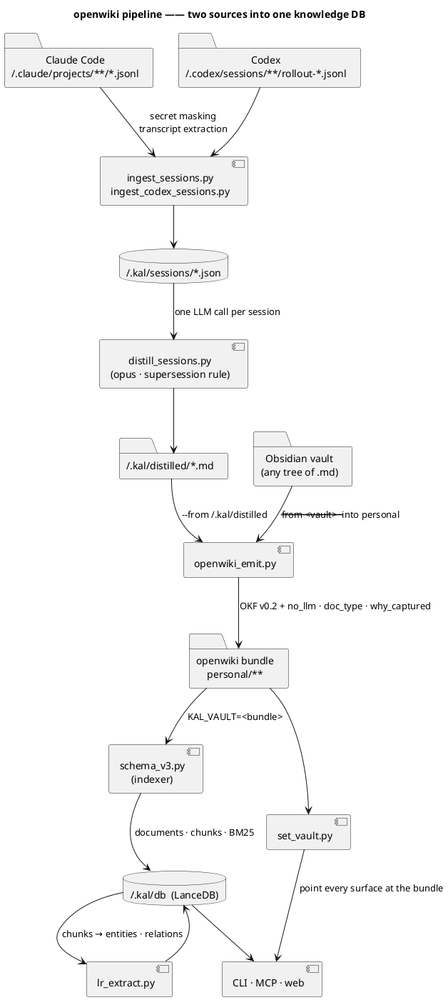

# The openwiki pipeline — two sources, one bundle, one knowledge DB

Everything worth keeping arrives from one of **two places**, and they have almost nothing in
common:

| | Source | What it needs | What it costs |
|---|---|---|---|
| **A** | Agent session logs — `~/.claude/projects/**/*.jsonl`, `~/.codex/sessions/**/rollout-*.jsonl` | an LLM, for hours | measured below |
| **B** | Markdown you already keep — an Obsidian vault, a docs folder, any tree of `.md` | nothing but the CPU | seconds |

Both land in the same place: an **openwiki bundle** — [OKF v0.2](https://github.com/GoogleCloudPlatform/open-knowledge-format)
plus three extension keys. From there one indexer builds the knowledge DB, and every surface
(CLI · MCP · web) reads that.

Keeping the halves separate is not tidiness. **They fail for different reasons** — path A dies on
rate limits and needs retries; path B is pure conversion and either works or has a bug. Running
them as one command means a rate limit stops a conversion that never needed the network.

---

## The whole picture



- **Read the two arrows into `openwiki_emit.py` first** — that single component is where both
  sources converge, and it is the only thing that writes into the bundle.
- The **`KAL_VAULT` label on the indexer arrow** is load-bearing; see *The vault lives in three
  places* below.
- `lr_extract` reads the **DB**, not the bundle — it never re-reads Markdown, which is why the
  index has to be rebuilt before the graph.

---

## Commands

```bash
just openwiki-status              # what is behind what.  Runs nothing, changes nothing
just openwiki-plan                # what would change.  Writes nothing

just openwiki-sessions            # A ── session logs → distilled → bundle      (hours, LLM)
just openwiki-vault <bundle> <vault>   # B ── any Markdown tree → bundle        (seconds)
just openwiki-enrich <bundle>     # fill missing OKF metadata with an LLM        (minutes)
just openwiki-index               # bundle → knowledge DB                       (~2 min)
just openwiki-kg                  # DB documents → entities + relations         (hours, LLM)
just openwiki-adopt               # point CLI · MCP · container at the bundle   (instant)

just openwiki                     # A + B + index, and prints the two steps it deliberately omits
```

`just openwiki` stops at the index on purpose. Indexing 1,116 documents takes about two minutes;
extracting the graph from them took **eight hours**. Folding an eight-hour step into the command
you run after a day's sessions means the command stops being run.

---

## Path A — agent sessions → bundle

```bash
just openwiki-sessions
```

Four programs, in order:

| | | Produces |
|---|---|---|
| `ingest_sessions.py` | Claude Code transcripts, secrets masked | `~/.kal/sessions/session_docs.json` |
| `ingest_codex_sessions.py` | Codex rollouts, same masking, imported never copied | `~/.kal/sessions/codex_session_docs.json` |
| `distill_sessions.py` | one LLM call per session → documents | `~/.kal/distilled/*.md` + `.done/` markers |
| `openwiki_emit.py` | those documents → OKF pages | `personal/sessions/{claude,codex}/` |

### What distillation is actually for

**A conversation is a thinking process, not a document.** It contains claims that were later
corrected, paths abandoned, guesses checked and found wrong. An earlier version of this step cut
sessions into fixed-length windows and pulled a topic out of each one — so a claim that was
overturned three messages later shipped as a standalone document stating it as fact.

The prompt now turns on one rule: **later beats earlier.** A thread becomes a document only when it
*closed* — the user confirmed it, a check passed, a decision was acted on. And when a claim was
overturned, **the correction itself becomes a document** (`doc_type: correction`) saying three
things: what was believed, what overturned it, and why the first belief was reasonable.

Measured on the full corpus (2026-09-02, opus, 492/493 sessions → 1,017 documents):

```
  correction     430  (42%)      ← a category the old prompt could not produce
  analysis       230
  investigation  221
  decision        89
  design 22 · retro 18 · discussion 4 · plan 3      —— 1,017 pages, counted from frontmatter
```

### Rate limits are about throughput, not concurrency

| Workers | Result |
|---|---:|
| 28 | collapsed — the early-abort guard fired at 76/481 |
| 12 | 12 sessions, 0 failures |
| 8 | 110/110, **0 failures**, 17.7 min |

Failures began around the fortieth session regardless of worker count, and calling `claude -p` by
hand at that same moment answered normally. Lower workers, and retry — a failed session leaves no
`.done` marker, so a re-run picks up exactly what is missing and costs nothing for the rest.

---

## Path B — any Markdown tree → bundle

```bash
just openwiki-vault ~/path/to/the/openwiki/bundle ~/path/to/the/vault
```

**No LLM.** This is conversion: frontmatter is mapped to OKF, `[[wikilinks]]` are resolved to
relative links, an `index.md` is generated per directory, and `.page-manifest.json` is rewritten.

One call walks the **whole** tree. The folder names used to be hardcoded — `wiki`, `kg`, `raw`,
`Clippings` — which quietly made the recipe work for exactly one vault; any other layout migrated
nothing and printed a success line. Dot-directories (`.obsidian/`, `.git/`, `.trash/`) are skipped
by the glob and need no exclusion.

Two exclusions are load-bearing:

- `--exclude /conversations/sessions/` — a vault that already holds a copy of the distilled session
  documents would send them a second time under `personal/raw/`: the same text, a second set of
  `doc_id`s, both indexed.
- `--exclude /kg/` — see *The graph export is not knowledge* below.

### What it will not do

- It never touches a file it did not write. Ownership is decided by a `resource: <agent>-session://`
  line **in the frontmatter block only** — matching the body once deleted a page that merely
  *documented* the format.
- It refuses to run if the bundle is not a git repository, or is inside `.gitignore`. Replacing
  pages is only safe when `git revert` exists.
- It refuses a `--from` inside the bundle, and an `--into` that escapes it.

---

## Filling what conversion could not invent

```bash
just openwiki-enrich <bundle>            # one LLM call per page that is missing metadata
just openwiki-enrich <bundle> --dry-run  # what it would ask about
```

`openwiki_emit` carries a key across when the source had one and **never invents metadata**. That
is right — a vault note that says nothing about why it was kept should not have a sentence made up
for it and filed as the author's. The consequence is measurable (2026-09-02):

| | `doc_type` | `why_captured` |
|---|---:|---:|
| the 1,017 pages `distill_sessions` wrote | 100% | 100% |
| the 96 pages migrated from a vault | 17% | 28% |
| the same 96, after `openwiki-enrich` ran (2026-09-03) | 100% | 100% |

So the choice is not "invent or not" but **who says it**. This step says it out loud: the page
records `filled_by: "process:openwiki_enrich.py/<version>"`, which a person can correct or delete.
A value that is silently absent cannot be corrected.

What it refuses to do:

- never sends a page the transmission gate blocks (`no_llm`), nor `references/`, nor an `index.md`
- never overwrites a key that is already there, including one a person wrote
- writes a `doc_type` **only** from the vocabulary — a value nobody filters on looks filled and
  matches nothing, which is worse than an absent key
- writes `doc_type` bare and inside the first 1,200 characters, because that is how the indexer
  reads it

## Index and graph

```bash
just openwiki-index      # ~2 min for 1,116 documents
just openwiki-kg         # hours
```

`openwiki-index` sets `KAL_VAULT` to the bundle **for one command**. `openwiki-kg` does the same,
and runs `--check-scope` first — the cheap way to see, before spending hours, that the extractor
and the indexer are looking at the same documents.

Measured, 2026-09-02:

| | |
|---|---|
| index (before enrichment) | 1,115 documents · 9,304 chunks · 6,132,241 postings · **108 s** |
| index (after, 2026-09-03) | 1,116 documents · 9,329 chunks · 6,146,494 postings · **112 s** |
| graph | 2,492 chunks · 8 workers · haiku · **~8 h** |

---

## After it works — `just openwiki-adopt`

Until this runs, the DB holds the bundle while the CLI, the MCP server and the web UI still read
the original vault. Nothing errors. It shows up as *"search finds things the screen cannot open."*

```bash
just openwiki-adopt
docker compose up -d          # the container follows only when the mount is retaken
```

Reversible: `just vault <the-original-vault>` and `docker compose up -d` again.

The galaxy graph is written to `~/.kal/graph_export/kal-graph.json`, not into the bundle.
A copy goes into a vault only when that vault has a `.obsidian/` —— a bundle is not an
Obsidian vault, and a plugin folder inside a git repository no plugin opens is only litter.
The mount, the `.env` value and `~/.kal/config.json` are three separate things —
[`DOCKER-SETUP.md`](DOCKER-SETUP.md) §5 has the check that proves all three agree.

---

## The traps, and the measurements behind them

### The vault lives in three places

`~/.kal/config.json` (CLI · MCP) · `.env` `VAULT_DIR` (container) · the running container's mount.
Change one and the others keep their old value **with no error at all** — the screen and the DB
simply disagree. `just vault` writes the first two; `docker compose up -d` fixes the third.

### Adopting arms a self-migration

`openwiki-vault` defaults its vault argument to `VAULT_DIR`, and `openwiki-adopt` sets `VAULT_DIR`
to the bundle. So the obvious next run converts the bundle **into itself**: every page re-slugged
and re-emitted beside the original. `openwiki_emit.py` refuses a `--from` inside the bundle; the
self-check for it is mutation-tested, because the pipeline's own success is what arms this.

### The graph export is not knowledge

`export_graph.py --obsidian` writes one note per entity, joined by `[[wikilinks]]`, so Obsidian's
graph view can draw the knowledge graph — that view only draws the *note link graph* and cannot read
a JSON graph. It is rendering scaffolding.

That approach was already replaced. `export_kal_graph.py` writes `kal-graph.json` inside the plugin
folder where Obsidian's search and graph never see it, and its docstring says why: notes *"inflate
the vault by 700 pages and bury the curated notes."* The indexer skips `kg/`
(`schema_v3.SKIP_ROOT`) because indexing it feeds the graph's own summaries back in as sources.

Those 699 pages were 38% of the bundle and contributed nothing to the DB. Removed 2026-09-02;
`--exclude /kg/` is what keeps them out.

### The pipeline logs its own LLM calls as sessions

Claude Code records every `claude_cli.run()` call as a session file indistinguishable from a human
conversation. `lr_extract`'s prompt embeds the chunk it is extracting from, so the distiller read
those and summarised the **embedded vault content** — producing documents that look excellent and
are degraded shadows of documents already in the corpus, with `sources[]` falsely claiming a
conversational origin. **153 of 298 bundle session documents traced back to this.**

Fixed at the single choke point: `claude_cli.run()` prefixes `PIPELINE_MARK`, and the ingester drops
a transcript that *starts* with it. Starts, not contains — a conversation that merely discusses the
marker (this one does, six times) must survive.

### Subagent reports were dropped twice

A parent session's `Task`/`Agent` call stores the child's report as a `tool_result`, and
`blocks_of()` never looked at `tool_result` at all. The findings a subagent was spawned to produce
were absent from every distilled document. Fixed by pairing `tool_use.id` ↔ `tool_result.tool_use_id`
(100% pairing measured) and keeping only Agent/Task results — Bash output stays out.

---

## Re-running — what to run after what changed

| Changed | Run |
|---|---|
| new sessions since last time | `just openwiki-sessions` — `.done` markers make it cheap |
| notes edited in the vault | `just openwiki-vault <bundle> <vault>` |
| either of the above | `just openwiki-index` |
| documents changed materially | `just openwiki-kg` (or `just refresh` for the stale ones only) |
| nothing — just checking | `just openwiki-status`, `just openwiki-plan` |

The distillation prompt changing is the one case that invalidates everything: delete
`~/.kal/distilled/.done/` and the documents, and run path A from the start.

---

## See also

- [`DOCKER-SETUP.md`](DOCKER-SETUP.md) — `.env`, the relay, and why the container keeps the old
  vault until it is recreated
- [`PIPELINE.md`](PIPELINE.md) — the older vault-centred path, and the internals of each step
  (caches, masking, `group_nodes`, search weighting) that are still current
- [`ARCHITECTURE.md`](ARCHITECTURE.md) — C4 diagrams and per-use-case sequences
- [`ERD.md`](ERD.md) — the DB schema the indexer writes
- `SPEC.md` in the bundle — OKF v0.2 and the three extension keys, line-cited to the pinned copy
